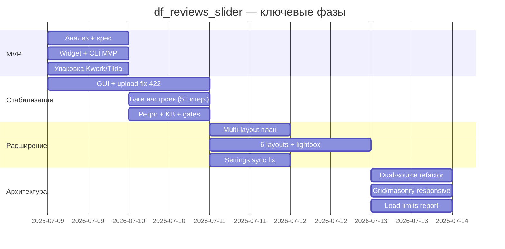

# Ретроспектива команды: df_reviews_slider

**Дата:** 2026-07-13  
**Проект:** `projects/df_reviews_slider/`  
**Версия:** v1.2.0 (dual-source + 6 layouts)  
**Источники:** [транскрипт сессии](7ec55229-5ad6-4945-81a1-a9833ca064c6), артефакты `2026-07-09` … `2026-07-13`, `retrospectives/2026-07-10-df-reviews-slider-retro.md`

---

## Executive summary

За **5 календарных дней** (09–13 июля) продукт прошёл путь от MVP-слайдера до **коммерчески упакованного dual-source виджета** с 6 макетами, мульти-клиентским CLI и тестовой матрицей. Технически результат сильный; процессно — **первые 40% времени съели баги настроек и обход review gates**. После ретро 10.07 команда стабилизировала KB и чеклисты; dual-source refactor (13.07) прошёл по упрощённому конвейеру с явными решениями владельца.

---

## Хронология фаз

| Фаза | Даты | Артефакты | Итог |
|------|------|-----------|------|
| **0. Идея и MVP** | 09.07 | `2026-07-09-reviews-slider/` | Виджет Swiper + CLI mixed + zip + Kwork-черновик |
| **1. Операционка** | 09–10.07 | — | GUI Tkinter, upload API fix, демо на myshop |
| **2. Кризис настроек** | 10.07 | `retrospectives/2026-07-10-*` | 5+ итераций чекбоксов; внедрён `insales-widgets.md` |
| **3. Продуктовое расширение** | 11–12.07 | `2026-07-11-df-reviews-slider-reports/` | 6 макетов, фото carousel, модалки, CLI-опции |
| **4. Dual-source** | 13.07 | `2026-07-13-reviews-sources-refactor/` | InSales prefetch + Yandex-only CLI |
| **5. Полировка** | 13.07 | `grid-masonry-responsive`, `load-limits` | Адаптив, scroll fix, документация лимитов |

---

## Что прошло хорошо

### 1. Быстрый MVP с референсом рынка

InSales Studio дал проверенную модель (CLI → Liquid → виджет). DanForge добавил **готовый виджет** и упаковку — дифференциатор зафиксирован в `01-analysis.md` (09.07).

### 2. Итеративная диагностика с HTML-клиента

Запрос `data-*` и классов с живого магазина ускорил фиксы 10.07. Паттерн «тройная защита Liquid + JS + CSS» стал стандартом KB.

### 3. Тестовая база после кризиса

| Файл | Checks | Покрывает |
|------|--------|-----------|
| `settings.test.js` | 10 | bool/rating парсеры |
| `settings-matrix.test.js` | 11 | матрица hide/show |
| `settings-sync.test.js` | 12 | CSS vars редактора |
| `layouts.test.js` | 14 | 6 режимов |
| `pagination.test.js` | 29 | page-size, load-more |
| `source-tabs.test.js` | 25 | dual-source tabs |
| CLI `test_*.py` | 10 | Yandex-only pipeline |

**Итого:** 101 unit-check без Playwright e2e на реальном inSales.

### 4. Осознанный архитектурный pivot (13.07)

Решения владельца (`00-owner-decisions.md`) сняли спорные ветки: нет вкладки «Все», Phase 1 hotfix пропущен, prefetch на любых страницах. Это сэкономило двойную работу.

### 5. Документация для продажи

README, INSTRUCTION.md, load-limits report, release checklist — продукт **упакован**, но не **запущен** (Kwork/danforge/пилот — pending).

---

## Что прошло плохо

### 1. Обход конвейера на MVP

MVP (09.07) шёл без Spec Reviewer, Plan Reviewer, Code Reviewer. Прямое следствие — волна багов 10.07 (~60% времени на фиксы vs первичная разработка, оценка владельца в ретро).

| Симптом | Корневая причина | Фикс |
|---------|------------------|------|
| Чекбоксы show-* не выключаются | nil + `else → true` | Модель `hide_*` |
| `"false"` truthy в Liquid | Строка в `` | Явный парсер |
| min-rating = label | Select отдаёт текст опции | `parseMinRating()` |
| hide_source всегда on | Backward compat show_source | Миграция + парсер |
| `layout` в settings → 500 | Зарезервированное имя | Переименовано в `display_mode` |

### 2. Scope creep без gate

| Дата | Расширение | Оценка влияния |
|------|------------|----------------|
| 10.07 | Фильтры, hide-*, CTA, accent | +1 день, баги |
| 11.07 | 6 layouts вместо 1 | +2 дня, SCSS/Swiper конфликты |
| 11.07 | Lightbox + фото carousel | +0.5 дня |
| 13.07 | Dual-source refactor | +1 день, но стратегически верно |

**Проблема:** каждое расширение добавляло поверхность для регрессий; матрица тестов догоняла код с задержкой.

### 3. Конкретные технические инциденты (примеры)

#### setOverlayOpen — scroll lock

Модалки (форма отзыва, «Читать полностью», lightbox) используют `setOverlayOpen(shell, true)` → класс `is-overlay-open` на `.df-reviews`. Баги возникали при **наложении нескольких оверлеев**: закрытие одного снимало lock, пока другой ещё открыт; на мобильных страница прокручивалась под модалкой. Исправлено проверкой `lightbox.hidden && modal.hidden` перед снятием класса — но edge-case при быстром double-click не покрыт тестами.

#### Liquid avatar failure → JS fix

Заглушка `insales-shop-avatar` через `img_url` в Liquid нестабильна для поля `file` в gen-4. Аватары отзывов о магазине не рендерились. Решение: `data-df-shop-avatar-url` в Liquid + `buildInsalesAvatarMarkup()` в JS с fallback на инициал, `meta.first_image`, shop avatar URL.

#### applyVisibility — регрессия при refactor

После удаления `applyDisplayOptions` (10.07) скрытие снова зависело только от Liquid-классов, которые **не обновляются** в live preview редактора. Восстановлен `applyVisibility()` с `!important` inline styles. В одной из итераций masonry (11–12.07) была **syntax error** при merge — `initWidget` падал целиком, все макеты «мертвые» до hotfix. Урок: 3700+ строк `snippet.js` без CI на синтаксис.

#### CLI upload 422

Поиск сниппета по `key` вместо `inner_file_name` → ложное CREATE → 422. Потеряно ~4 часа на probe-скрипты (09.07, транскрипт). Исправление стало эталоном для Theme API KB.

#### Вкладки и random.shuffle

До dual-source: `random.shuffle(picked)` ломал хронологию; `applySourceTab` не пересчитывал pagination/Swiper. Обе проблемы документированы в `01-analysis.md` refactor — исправлены в Phase 2, не в hotfix (осознанный skip Phase 1).

### 4. CLI отстаёт от виджета

`gui.py` до сих пор показывает «Сбор отзывов inSales + Яндекс», поля `insales_ratio`, `source_mode: mix` по умолчанию — **противоречит** v1.2.0 и `INSTRUCTION.md`. INSTRUCTION обновлён, GUI — нет. Типичный drift «ядро обновили, оболочку забыли».

### 5. Review gates — непоследовательность

| Задача | Analyst | Plan Rev | Code Rev |
|--------|---------|----------|----------|
| MVP 09.07 | ✅ | ❌ | ❌ |
| Settings fix 10.07 | ❌ | ❌ | ❌ |
| Multi-layout 11.07 | частично | ❌ | ❌ |
| Dual-source 13.07 | ✅ | pending/in progress | pending |

**Вывод:** gates работают как документация, не как блокер — пока владелец в чате напрямую.

### 6. Коммуникация

- Правило подписей ролей введено 11.07 (`team-response-format.md`) — **после** хаотичных сессий 09–10.07.
- Дублирование user_query 10.07 (два одинаковых сообщения) — признак спешки без чеклиста «принято к работе».

---

## Процессные wins и mistakes — сводка

| Категория | Win | Mistake |
|-----------|-----|---------|
| **Review gates** | Ретро → ADR quality, обязательный маршрут inSales-виджет | MVP и hotfix в обход |
| **Scope** | Dual-source по решениям владельца — один PR-логика | 6 layouts + filters + GUI за 3 дня без freeze |
| **Bugfix cycles** | Матрица настроек + 101 unit test | 5+ итераций до появления тестов |
| **Communication** | Артефакты на каждый этап | GUI/INSTRUCTION рассинхрон |
| **Platform KB** | `insales-widgets.md` после боли | KB не было до старта |

---

## Уроки для согласованной работы

### Обязательно сохранить

1. **Матрица настроек в spec** — каждый checkbox/range/select: ON, OFF, default.
2. **HTML-проба с клиента** перед закрытием задачи.
3. **Owner decisions файл** при архитектурном pivot (`00-owner-decisions.md`).
4. **Отчёт лимитов** (`load-limits/05-report.md`) — снижает вопросы поддержки.

### Изменить на следующий продукт

1. **Freeze scope после MVP** — v1.1 только по APPROVED plan; expansions (layouts, dual-source) = отдельные task-id.
2. **GUI = часть Definition of Done** — при смене CLI pipeline обновлять `gui.py` в том же коммите.
3. **Syntax check в CI** — `node --check snippet.js` + `python -m py_compile`.
4. **Plan Reviewer = блокер** для inSales-виджетов > 4 ч (не «pending»).
5. **Пилот до Kwork** — в roadmap «упаковка done», но `02-pilot-checklist` не закрыт.

### Метрики (оценочно)

| Метрика | Значение |
|---------|----------|
| Календарных дней | 5 |
| Версий CHANGELOG | 3 (1.0.0 → 1.0.1 → 1.2.0) |
| Итераций фикса настроек | 5+ (до 10.07) |
| Unit checks | 101 |
| E2e inSales | 0 автоматических |
| Артефактов в `artifacts/` | 8+ папок |
| Публикация Kwork | 0 (черновик готов) |

---

## Рекомендации команде (приоритет)

| # | Действие | Кто | Срок |
|---|----------|-----|------|
| 1 | Закрыть пилот → скрины → Kwork | Владелец + Programmer | 1 неделя |
| 2 | CLI rebuild (CustomTkinter + sync с yandex-only) | Planner → Programmer | 2–3 дня |
| 3 | Code Review dual-source + smoke matrix 6×2 tabs | Code Reviewer | 1 день |
| 4 | Обновить roadmap (reviews-slider = shipped, CLI next) | Jarvis | сразу |
| 5 | Playwright smoke на `layouts.html` в CI | Programmer | 4 ч |

---

## Связанные артефакты

- `artifacts/retrospectives/2026-07-10-df-reviews-slider-retro.md`
- `artifacts/2026-07-11-df-reviews-slider-settings-analysis.md`
- `artifacts/2026-07-13-reviews-sources-refactor/05-report.md`
- `knowledge/platforms/insales-widgets.md`
- `knowledge/strategy/decisions/2026-07-10-quality-process.md`
