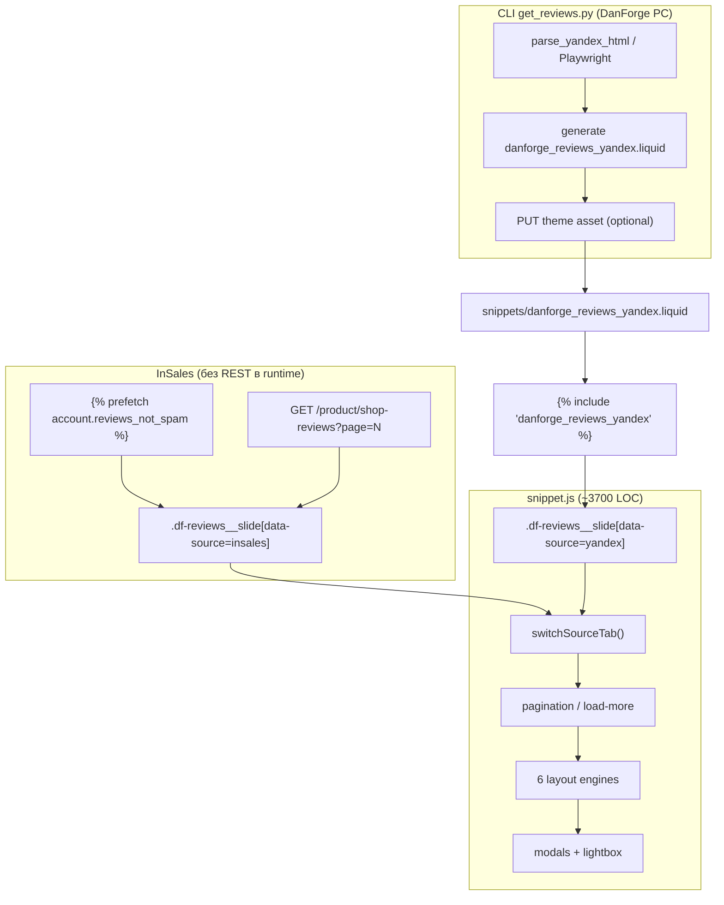
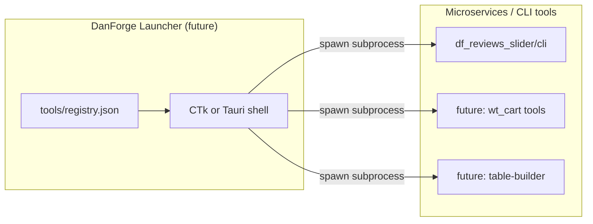

# Технический отчёт: df_reviews_slider v1.2.0

**Дата:** 2026-07-13  
**Статус:** реализация завершена, пилот и CLI rebuild — pending  
**Папка:** `projects/df_reviews_slider/`

---

## Executive summary

Виджет — **gen-4 dual-source** блок отзывов: InSales через Liquid prefetch + AJAX, Яндекс через CLI-сниппет. Шесть режимов отображения, модалки, lightbox, Masonry с боковыми вкладками. Ядро зрелое; узкие места — **размер DOM при больших лимитах**, **отсутствие e2e**, **рассинхрон GUI**. CLI требует пересборки под yandex-only и бренд DanForge.

---

## Архитектура данных



### Разделение ответственности

| Слой | InSales | Яндекс |
|------|---------|--------|
| **Сбор** | Платформа (prefetch + AJAX) | CLI парсер / JSON fallback |
| **Хранение** | БД магазина | Liquid-сниппет в теме |
| **Обновление** | Автоматически + AJAX кнопка | `get_reviews.py -u` или ручная вставка |
| **Фильтр рейтинга** | Liquid + JS display | CLI при генерации + JS display |
| **Лимит показа** | Настройки виджета | Настройки виджета + `yandex_limit` в CLI |

### Legacy fallback

`danforge_reviews_slides.liquid` (mixed mode) — подключается, если Yandex-сниппет пуст. Риск дублирования inSales при устаревшем mixed-файле в теме. Рекомендация: удалять legacy после миграции клиента.

---

## Ключевые файлы и паттерны

| Файл | LOC (≈) | Роль |
|------|---------|------|
| `widget/snippet.liquid` | ~1066 | Prefetch, вкладки, schema, форма отзыва, data-* |
| `widget/snippet.js` | ~3724 | Layouts, pagination, tabs, modals, masonry |
| `widget/snippet.scss` | ~2292 | 6 layouts, responsive, overlay, floating CTA |
| `widget/settings_form.json` | — | 40+ настроек, вкладки «Контент» / «Дизайн» |
| `cli/get_reviews.py` | ~1259 | Yandex pipeline, theme upload, `--insales-backup` |
| `cli/gui.py` | ~489 | Tkinter multi-client (**устарел**) |
| `cli/clients_manager.py` | — | Профили клиентов, `last_run.json` |

### Паттерны (переиспользовать)

1. **`data-source="insales|yandex"`** на каждом слайде — единый переключатель вкладок.
2. **`data-sort-ts`** — Unix timestamp для сортировки (без shuffle).
3. **Тройная защита настроек** — Liquid class + `data-hide-*` + JS `applyVisibility()`.
4. **`syncSettingsFromLayout()`** — чтение CSS vars с `.layout` (live preview inSales).
5. **`prepareStaticLayout()`** — снятие `swiper-slide`, inline grid/masonry для обхода глобального Swiper CSS.
6. **`filterSlides` без `.remove()`** — только `is-hidden` (dual-source refactor).
7. **Photo previews** — `data-photo-previews` (medium) + `data-photo-urls` (original) для lightbox.

### Режимы макета

| Режим | Движок | Лимит | Особенности |
|-------|--------|-------|-------------|
| `slider` | Swiper | `slider-limit` | InSales AJAX load-more |
| `spotlight` | Swiper centered | `spotlight-limit` | 1 крупная карточка |
| `marquee` | CSS animation + clone | `marquee-limit` | Скорость desktop/mobile |
| `masonry` | column-count + JS layout | `page-size` | Боковые tabs + счётчики, «Показать ещё», floating CTA |
| `grid` | CSS grid | `page-size` | Пагинация, floating CTA |
| `list` | vertical stack | `list-limit` | **Без** InSales AJAX |

Полная таблица лимитов: `artifacts/2026-07-13-reviews-load-limits/05-report.md`.

---

## Модалки, аватары, overlay

### Модальные окна (3 типа)

1. **Review modal** — «Читать полностью» (`data-df-reviews-modal`)
2. **Lightbox** — фото отзыва (`data-df-reviews-lightbox`)
3. **Form modal** — нативная форма inSales (`data-df-reviews-form-modal`)

Все используют `setOverlayOpen(shell, isOpen)` → `is-overlay-open` на shell → `overflow: hidden`.

### Аватары

| Источник | Механизм |
|----------|----------|
| Yandex | URL из парсера → в Liquid сниппете |
| InSales товар | `meta.first_image.medium_url` через JS |
| InSales магазин | `insales-shop-avatar` (file) → `data-df-shop-avatar-url` + JS `buildInsalesAvatarMarkup()` |
| Placeholder | Инициал автора |

**Важно:** Liquid `img_url` для file-поля ненадёжен — JS-fallback обязателен.

---

## Производительность

### DOM и память

| Сценарий | Узлов в DOM (оценка) | Риск |
|----------|----------------------|------|
| slider-limit=10, yandex_limit=20 | ~30 слайдов + pool | Низкий |
| masonry page-size=12, prefetch=12, yandex=50 | ~74 | Средний |
| marquee-limit=50 + все Yandex в DOM | 50+ | Высокий на mobile |
| InSales AJAX + load-more accumulate | Рост без потолка | **Высокий** при активном AJAX |

**Рекомендации:**

- Держать `yandex_limit` ≤ 20–30 на главной.
- `insales-prefetch-limit` ≈ `page-size`, не max 50 без need.
- Marquee: не ставить `marquee-limit` > 25 на слабых темах.
- Рассмотреть **virtualization** для list/masonry при > 100 слайдов (v2).

### Фото

- Lightbox грузит **previews** (medium) первым — правильно.
- Все `` в сниппете CLI — OK.
- Карусель Яндекса: до N фото на отзыв — DOM тяжелеет; нет lazy для thumbnails в карточке.

### Masonry

- `scheduleMasonryLayout()` пересчитывает на resize, tab switch, pagination — **O(n)** по видимым слайдам.
- «Показать ещё» с `preserveScroll` — исправлен scroll jump (13.07).
- При частом resize возможен layout thrashing — debounce 150ms уже есть в observer.

### Marquee

- Клонирует DOM-узлы для бесшовной анимации — удваивает узлы в режиме.
- `marquee-speed` / `marquee-speed-mobile` — CSS variables, лёгкие.

### Swiper

- Инициализируется на видимых слайдах; при tab switch — destroy + reinit (dual-source).
- Скрытые `display:none` слайды в старой архитектуре давали пустые места — исправлено в `switchSourceTab`.

---

## Тестовое покрытие

### Что есть ✅

| Область | Тесты | Пробел |
|---------|-------|--------|
| Парсеры настроек | settings*.test.js | — |
| 6 layouts parse | layouts.test.js | Нет DOM render |
| Pagination math | pagination.test.js | — |
| Source tabs | source-tabs.test.js | Нет integration с Swiper |
| CLI Yandex-only | test_cli_yandex_only.py | Нет upload mock |
| Yandex parser | test_yandex_parser.py | Нет fixture HTML versioning |

### Критические gaps ❌

| # | Gap | Impact | Приоритет |
|---|-----|--------|-----------|
| 1 | Нет Playwright/e2e на реальном inSales | Регрессии в редакторе | P0 |
| 2 | Нет тестов `loadInsalesPage` (AJAX) | Сломается при смене HTML темы | P0 |
| 3 | Нет тестов modals/lightbox/overlay | setOverlayOpen regressions | P1 |
| 4 | Нет тестов `buildInsalesAvatarMarkup` | Аватары магазина | P1 |
| 5 | Нет visual regression (6 layouts) | CSS drift | P2 |
| 6 | `visibility.html` — ручной smoke | Не в CI | P2 |
| 7 | Нет performance budget test | DOM > N слайдов | P3 |

---

## Оптимизации (приоритизировано)

| P | Задача | Effort | Эффект |
|---|--------|--------|--------|
| **P0** | Cap DOM: lazy Yandex block до первого клика на вкладку | 8 ч | −30–50% initial DOM |
| **P0** | AJAX inSales: abort + max pages guard | 4 ч | Защита от runaway DOM |
| **P1** | Split `snippet.js` на модули (tabs, pagination, layouts) | 16 ч | Maintainability |
| **P1** | Thumbnail lazy + intersection observer для фото в карточках | 6 ч | LCP/TTI |
| **P1** | Версионирование Yandex HTML fixtures в CI | 4 ч | Ранний алерт поломки парсера |
| **P2** | Service Worker / none — не нужен (static snippet) | — | — |
| **P2** | `upload_avatars` в Files inSales — включить по умолчанию для Yandex | 4 ч | Меньше внешних запросов |
| **P3** | WebP conversion при upload аватаров | 8 ч | Bandwidth |

---

## CLI: текущее состояние vs виджет (gap analysis)

### Виджет v1.2.0 ожидает

- Сниппет: `danforge_reviews_yandex.liquid` (не mixed slides)
- InSales: **не** из CLI, только prefetch в виджете
- `source_mode: yandex` в config
- Поля: `yandex_limit`, `yandex_org_url`, `min_rating`
- Upload: Theme API → `inner_file_name = danforge_reviews_yandex.liquid`
- Опционально: ручная вставка сниппета (без API)

### CLI core (`get_reviews.py`) ✅

| Функция | Статус |
|---------|--------|
| Yandex-only standard run | ✅ |
| `danforge_reviews_yandex.liquid` output | ✅ |
| Sort DESC, no shuffle | ✅ |
| `--insales-backup` diagnostic | ✅ |
| Multi-client via config path | ✅ |
| Manual copy fallback (`Копировать сниппет`) | ✅ в GUI |
| Legacy `mix` mode | ⚠️ deprecated, код остался |

### GUI (`gui.py`) ❌ drift

| Элемент GUI | Проблема | Нужно |
|-------------|----------|-------|
| Заголовок окна | «Слайдер отзывов» — OK | — |
| Подзаголовок формы | «Сбор inSales + Яндекс» | «Yandex → сниппет темы» |
| `insales_ratio` | Legacy mixed | **Удалить** |
| `source_mode` default `mix` | Противоречит v1.2 | Default `yandex`, убрать `mix` из UI |
| `sample_count` label | «Отзывов в слайдере» | «Yandex limit» + tooltip |
| Нет `yandex_limit` field | Использует sample_count | Явное поле |
| Нет прогресс-бара | Долгий Playwright | Добавить |
| Нет режима «только файл» | Для клиентов без API | Wizard: generate → copy → manual |
| Брендинг | ttk «Windows 95» | CustomTkinter |

### INSTRUCTION.md ✅

Актуален под dual-source. GUI и INSTRUCTION расходятся — **источник правды: INSTRUCTION + README**, не gui.py.

### Gap summary table

| Capability | Widget needs | CLI core | GUI |
|------------|--------------|----------|-----|
| Yandex-only generation | ✅ | ✅ | ⚠️ mix default |
| Upload snippet | ✅ | ✅ | ✅ |
| Manual snippet workflow | ✅ | ✅ file output | ⚠️ кнопка есть, не в wizard |
| InSales API fetch | ❌ not needed | ⚠️ backup only | ❌ implied in UI |
| Multi-client batch | ✅ | ✅ | ✅ |
| Scheduler hint | ✅ | ✅ bat | ✅ |
| Progress UX | — | ❌ | ❌ |
| DanForge brand | — | ❌ | ❌ |

---

## CustomTkinter migration — scope и структура

**Рекомендация:** Этап A из `02-cli-interface-options.md` — 8–16 ч.

### Scope v1 GUI rebuild

```
cli/
├── get_reviews.py          # без изменений логики
├── clients_manager.py      # без изменений
├── gui/
│   ├── __init__.py
│   ├── app.py              # CTk main window
│   ├── theme.py            # DanForge colors (#212528, #fba064)
│   ├── panels/
│   │   ├── clients_sidebar.py
│   │   ├── yandex_form.py      # URL, limit, min_rating, JSON fallback
│   │   ├── theme_form.py       # shop, API (optional), theme_id
│   │   └── run_panel.py        # buttons, progress, log
│   └── widgets/
│       └── log_view.py
├── start.bat
└── requirements.txt        # + customtkinter
```

### Убрать из UI

- `insales_ratio`, `source_mode: mix/insales`
- Подписи про «сбор inSales»
- Лишние чекбоксы без эффекта в yandex-only

### Добавить в UI

| Элемент | Назначение |
|---------|------------|
| Секция «Яндекс» | URL, limit, min_rating, Playwright toggle |
| Секция «Тема (опционально)» | API только для upload; collapse если «только файл» |
| **Режим установки** | `Авто (API)` / `Ручной (файл)` |
| Progress bar | Парсинг страниц Яндекса |
| Статус-карточка последнего run | из `last_run.json` |
| Бренд | логотип, тёмная тема, `#fba064` accent |

### Оценка

| Подзадача | Часы |
|-----------|------|
| CTk shell + theme | 4 |
| Формы + sync config | 4 |
| Run panel + progress | 3 |
| Manual workflow wizard | 3 |
| PyInstaller smoke | 2 |
| **Итого** | **16** |

---

## Unified launcher — feasibility sketch

**Визия владельца:** CLI = один microservice tool; позже — единый launcher для всех DanForge tools.



### Минимальная архитектура (фаза 1)

| Компонент | Описание |
|-----------|----------|
| `tools/registry.json` | `{ id, name, path, start_cmd, icon, version }` |
| `launcher/main.py` | CustomTkinter: список tools, кнопка «Запустить» |
| Контракт tool | `start.bat` или `python -m tool.gui` + общий `~/.danforge/` для логов |
| Изоляция | Каждый tool — свой venv или shared `danforge-tools` venv |

### Фаза 2 (опционально)

- Shared `clients/` registry (один магазин — несколько tools)
- Единый `config.schema.json` для API keys
- Web dashboard (FastAPI) — если tools > 5

### Feasibility

| Критерий | Оценка |
|----------|--------|
| Техническая сложность | Низкая (subprocess + JSON) |
| Когда имеет смысл | ≥ 3 упакованных CLI |
| Сейчас | 1 CLI — **рано**, но заложить `registry.json` при CTk rebuild |
| Effort фаза 1 | 12–20 ч |

### Рекомендация

При rebuild CLI reviews_slider:
1. Вынести `gui/` в подпакет с entry point `python -m gui.app`
2. Добавить `tool.manifest.json` (id, version, capabilities)
3. Не строить launcher до 2-го tool — избежать over-engineering

---

## Клиенты без InSales API (техническая сторона)

| Операция | Нужен API? | Альтернатива |
|----------|------------|--------------|
| Показ InSales-отзывов | **Нет** | Liquid prefetch |
| InSales AJAX load-more | **Нет** | Публичная страница `/product/shop-reviews` |
| Upload Yandex snippet | **Да** (Theme API) | Ручная вставка в Snippets редактора темы |
| Проверка магазина | **Да** | Только админка владельца |
| CLI на ПК DanForge | API владельца DanForge | OK для «под ключ» |

**Manual snippet workflow (уже поддержан):**

```
python get_reviews.py --dry-run  # или без --upload
→ output/danforge_reviews_yandex.liquid
→ копировать в Тема → Snippets → создать/обновить файл
```

GUI: кнопка «Копировать сниппет» есть; нужен **wizard** и явный режим «Без API».

---

## Версии и deploy

| Версия | Дата | Суть |
|--------|------|------|
| 1.0.0 | 09.07 | MVP slider + mixed CLI |
| 1.0.1 | ~10.07 | Упаковка, Kwork, zip |
| 1.2.0 | 13.07 | Dual-source, 6 layouts, limits doc |

**Deploy checklist:** README § Deploy + `templates/insales-widget-checklist.md`

---

## Связанные документы

- `projects/df_reviews_slider/README.md`
- `artifacts/2026-07-13-reviews-load-limits/05-report.md`
- `artifacts/2026-07-11-df-reviews-slider-reports/02-cli-interface-options.md`
- `artifacts/2026-07-13-reviews-sources-refactor/05-report.md`
