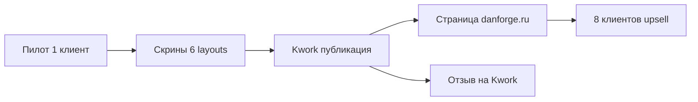

# Бизнес-отчёт: df_reviews_slider

**Дата:** 2026-07-13  
**Продукт:** Слайдер / блок отзывов inSales + Яндекс  
**Статус продажи:** упаковка готова, **не опубликован**, пилот не закрыт

---

## Executive summary

Продукт закрывает широкую боль e-commerce: **социальное доказательство с двух источников** в одном блоке с 6 режимами отображения. Ценовой коридор 8–10 тыс. ₽ обоснован. Главный незакрытый риск — **нет пилота и скринов**; второй — **сегмент клиентов без API** требует отдельного SKU. Рекомендация: пилот → Kwork → danforge, параллельно tier «Без API».

---

## Позиционирование

### Одно предложение

**«Живые отзывы inSales и Яндекс в одном блоке на главной — 6 форматов, без сервера у клиента, обновление за 5 минут.»**

### Целевая аудитория

| Сегмент | Признаки | Приоритет |
|---------|----------|-----------|
| **Основной** | inSales, 30+ отзывов, профиль в Яндекс Картах | Высокий |
| **Расширенный** | 100+ отзывов, нужен masonry/лента | Высокий |
| **Без API** | Тариф inSales без REST API, есть админка | Средний (новый SKU) |
| **Только inSales** | Нет Яндекса | Низкий (урезанный пакет) |

### Конкурентная карта

| Игрок | Что даёт | Слабость vs DanForge |
|-------|----------|----------------------|
| **InSales Studio** | PHP get-reviews, сниппет | Нет готового виджета, DIY |
| **Встроенный RS-6** | Отзывы о товарах | Нет Яндекса, нет merge |
| **Ручные блоки Tilda/конструктор** | Статика | Не масштабируется |
| **Фриланс «с нуля»** | Кастом | Дорого, без поддержки |

### УТП DanForge (актуализировано v1.2)

| # | УТП | Доказательство |
|---|-----|----------------|
| 1 | **Dual-source** InSales (живые) + Яндекс (CLI) | Prefetch + `danforge_reviews_yandex.liquid` |
| 2 | **6 макетов** в одном виджете | slider, masonry, grid, list, spotlight, marquee |
| 3 | **Masonry + боковые вкладки** со счётчиками | Уникально vs Studio |
| 4 | **Без сервера у клиента** | CLI на стороне DanForge |
| 5 | **Фото отзывов + lightbox** | Парсер carousel v1.4 |
| 6 | **Партнёр inSales + danforge.ru** | Доверие B2B |
| 7 | **Работа без API inSales** (частично) | InSales через Liquid; ручной сниппет Яндекса |

---

## Ценообразование — валидация и обновление

### Текущие цены (knowledge + Kwork-черновик)

| Пакет | Было | Рекомендация v1.2 | Обоснование |
|-------|------|-------------------|-------------|
| **Под ключ** | 8 000 ₽ | **8 000 ₽** | Базовый вход, установка + 1 генерация |
| **Стандарт** | 10 000 ₽ | **10 000–12 000 ₽** | + mobile QA, CTA, выбор макета, 1 мес поддержки |
| **Pro** (новый) | — | **14 000–16 000 ₽** | Masonry + вкладки + настройка лимитов + 2 обновления Яндекса |
| **Только файлы** | 4 000 ₽ | **5 000 ₽** | Вырос scope (6 layouts, dual-source) |
| **Обновление Яндекса** | 2 000 ₽ | **2 000 ₽** | Без изменений |
| **Ежемесячное обновление** | 1 000–1 500 ₽/мес | **1 500 ₽/мес** | Cron на стороне DanForge |

**Сравнение с корзиной (6 000 ₽):** отзывы дороже — оправдано backend (парсер), dual-source, 6 UI modes.

### Новый tier: «Без API» / Manual

| Пакет | Цена | Состав |
|-------|------|--------|
| **Стандарт Manual** | **9 000 ₽** | Виджет + установка; Яндекс: DanForge генерирует файл, **владелец вставляет** сниппет в тему по инструкции |
| **Под ключ Manual** | **7 000 ₽** | Виджет на главной; без автозагрузки; 1 видео-инструкция |
| **Доп. визит в админку** | **+1 500 ₽** | Если нужен доступ без API, только ручная работа |

**Маржа:** ниже (больше ручного труда), но открывает ~30–40% магазинов на младших тарифах inSales без API.

---

## Упаковка: Standard vs Pro, CLI

| Компонент | Standard (10k) | Pro (15k) |
|-----------|----------------|-----------|
| Виджет + установка | ✅ | ✅ |
| Макет на выбор | 1 (slider или grid) | Любой + masonry |
| Вкладки InSales/Яндекс | ❌ | ✅ |
| Первая генерация Яндекса | ✅ | ✅ |
| Обновления Яндекса | 1 раз | 2 раза за 3 мес |
| CLI клиенту | ❌ | Опционально |
| Поддержка | 14 дней | 30 дней |

### CLI: add-on или included?

| Стратегия | Плюсы | Минусы | Рекомендация |
|-----------|-------|--------|--------------|
| **Не отдавать клиенту** | Контроль, recurring update fee | Зависимость от DanForge | ✅ Default для Kwork |
| **Включить в Pro** | «Премиум» ощущение | Support burden | Только для dev-savvy |
| **Add-on +3 000 ₽** | Апселл | Нужна документация | Для агентств |

**Вывод:** CLI **не в Standard**; в комплекте только для Pro/агентств. Публично позиционировать: «обновление за 5 минут силами DanForge» — не «установите Python».

---

## Kwork vs danforge.ru

| Канал | Роль | Статус | Действие |
|-------|------|--------|----------|
| **Kwork** | Быстрые сделки, социальное доказательство | Черновик готов, не опубликован | Пилот → скрины → публикация |
| **danforge.ru** | Якорь цены, SEO, доверие | Гайд готов, страница нет | После Kwork или параллельно |
| **Текущие 8 клиентов** | Upsell | Не начат | Персональное предложение после пилота |
| **Партнёрка inSales** | Долгосрочно | Не в scope | Отложить |

### Стратегия запуска

**Kwork first?** — **Да**, если пилот в течение 7 дней. Danforge без скринов конвертит слабо. Kwork даёт быстрый feedback и ценовой тест.

### Текст Kwork — что обновить под v1.2

- Упомянуть **6 макетов** (не только слайдер)
- **Dual-source**: inSales обновляются сами
- Убрать акцент на «случайный срез» → «умные лимиты по режиму»
- Добавить опцию **«без API»** как отдельный пакет в описании

---

## Клиенты БЕЗ InSales API — продуктовые решения

### Проблема

На части тарифов inSales **нет REST API** → нельзя автоматически загрузить сниппет через CLI `-u`.

### Что всё равно работает без API

| Функция | Механизм |
|---------|----------|
| InSales-отзывы на сайте | Liquid prefetch (платформа) |
| InSales AJAX «Загрузить ещё» | Публичный HTML |
| Яндекс-отзывы | **Ручной** сниппет в теме |
| Виджет, все макеты | Файлы виджета через админку |

### Решения (ранжировано)

| # | Решение | Для кого | Трудозатраты DanForge |
|---|---------|----------|----------------------|
| 1 | **Manual snippet workflow** (уже в CLI) | Все без API | +15 мин на клиента |
| 2 | **Видео-инструкция** «вставить сниппет за 3 мин» | DIY-клиенты | 1 ч один раз |
| 3 | **DanForge гоняет CLI у себя** + высылает файл | Под ключ Manual | Как сейчас |
| 4 | **Доступ в админку** только на установку | Под ключ | Стандартный процесс |
| 5 | **Только inSales** (без Яндекса) | Нет Яндекс-профиля | −2 000 ₽ к цене |
| 6 | **Парсер как «услуга»** без CLI клиенту | Standard Manual | Recurring 2 000 ₽ |

### Hybrid tiers

| Tier | API нужен? | Яндекс | Цена |
|------|------------|--------|------|
| **Full Auto** | Да (DanForge) | CLI upload | 10 000 ₽ |
| **Manual** | Нет | Файл + инструкция | 9 000 ₽ |
| **InSales Only** | Нет | — | 6 000 ₽ |

**Pricing impact:** Manual tier снижает барьер входа, но **не снижать** цену ниже 7 000 ₽ — ручная работа компенсируется.

---

## Go-to-market: пилот и шаги

### Пилот (критический path)

| Шаг | Критерий готовности |
|-----|---------------------|
| 1 | Клиент с 50+ отзывами + Яндекс (или demo myshop) |
| 2 | Установка по `02-pilot-checklist.md` |
| 3 | Smoke: 6 layouts × вкладки on/off |
| 4 | 6 скринов desktop + 3 mobile |
| 5 | Отзыв клиента (1–2 предложения) |

**Срок:** 3–5 рабочих дней после выбора клиента.

### Публикация

| # | Задача | Оценка |
|---|--------|--------|
| 1 | Kwork — публикация с обновлённым текстом | 2 ч |
| 2 | danforge.ru страница по Tilda-гайду | 3 ч |
| 3 | Карточка на `/services/modules` | 1 ч |
| 4 | Пост в блог «как объединить отзывы» | 4 ч (SEO) |

---

## Revenue scenarios (июль–сентябрь 2026)

**Допущения:** сезон затишья, 1–2 сделки/мес без активного Kwork до публикации.

| Сценарий | Kwork заказов | Средний чек | Доп. обновления | Выручка/3 мес |
|----------|---------------|-------------|-----------------|---------------|
| **Пессимист** | 1 | 8 000 | 0 | **8 000 ₽** |
| **База** | 3 | 9 500 | 2 × 2 000 | **32 500 ₽** |
| **Оптимист** | 5 | 11 000 | 4 × 2 000 + 1 Pro 15k | **79 000 ₽** |
| **+ Upsell 2 из 8** | +2 | 8 000 | — | **+16 000 ₽** |

**Точка безубыточности времени:** ~2 сделки «Под ключ» окупают разработку сезона (оценка 40–60 ч × ставка владельца).

### Рычаги роста

1. Публикация Kwork — **×3 к базе** (история DanForge: весна 2026)
2. Masonry в галерее Kwork — визуальный дифференциатор
3. Пакет Manual — +30% адресуемого рынка
4. Recurring обновления — 1 500 ₽/мес × 5 клиентов = 7 500 ₽/мес (год 2)

---

## Риски для бизнеса

| Риск | Митигация |
|------|-----------|
| Парсер Яндекса сломается | JSON fallback; мониторинг; 2 000 ₽ fix |
| Нет пилота → слабая галерея Kwork | Demo myshop как временные скрины |
| Клиент без API — отказ | Tier Manual |
| Scope creep в поддержке | Чёткие пакеты Standard/Pro |
| Конкурент скопирует | Скорость + masonry + бренд |

---

## Рекомендации владельцу (топ-5)

1. **Закрыть пилот за 7 дней** — блокер монетизации.
2. **Опубликовать Kwork** с ценой Standard 10 000 ₽, Под ключ 8 000 ₽.
3. **Ввести tier Manual (9 000 ₽)** в описании — снять возражение «нет API».
4. **CLI не включать в Standard** — услуга обновления 2 000 ₽ / 1 500 ₽/мес.
5. **Upsell 2 лояльным клиентам** с отзывами после пилота.

---

## Связанные артефакты

- `knowledge/danforge/products/df-reviews-slider.md`
- `artifacts/2026-07-09-reviews-slider/03-kwork-listing.md`
- `artifacts/2026-07-09-reviews-slider/04-tilda-build-guide.md`
- `artifacts/2026-07-09-reviews-slider/02-pilot-checklist.md`
