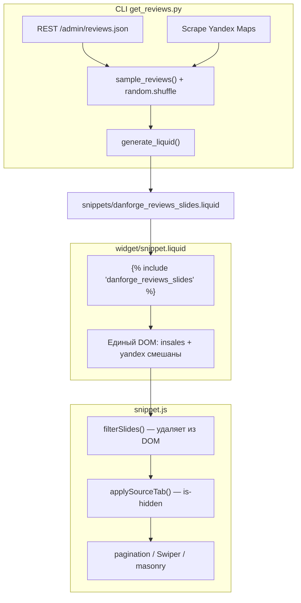
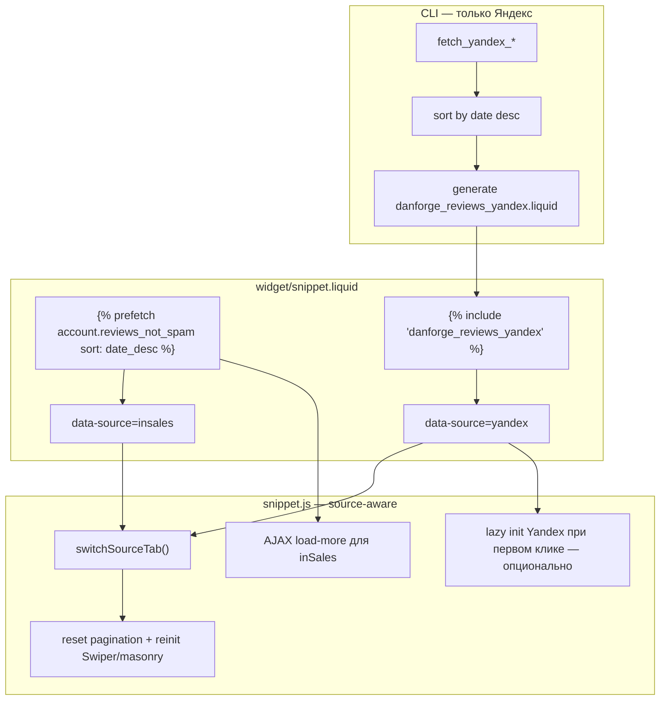

# Анализ: рефакторинг источников отзывов DanForge Reviews Slider

**Дата:** 2026-07-13  
**Задача:** отказ от REST API для inSales-отзывов, нативная загрузка через Liquid; исправление вкладок и сортировки  
**Область:** `projects/df_reviews_slider/`  
**Статус:** анализ для Spec Reviewer → Architect (упрощённый конвейер inSales-виджет)

---

## Цель

Перестроить архитектуру источников отзывов так, чтобы:

1. **InSales** — загружались платформой (`account.reviews_not_spam`, ``, `sort: 'date_desc'`), как в `test/snippet.liquid`.
2. **Яндекс** — оставались в CLI (скрапинг → generated snippet).
3. **Вкладки** `.df-reviews__tabs` — показывали только отзывы выбранного источника во всех режимах (slider, masonry, grid, list, …).
4. **Сортировка** — новые первые (`date_desc`) единообразно, без случайного перемешивания.
5. **Производительность** — рассмотреть lazy-load / AJAX по источнику.

---

## Контекст

| Компонент | Роль сегодня |
|-----------|--------------|
| `cli/get_reviews.py` | REST `/admin/reviews.json` + парсер Яндекса → `danforge_reviews_slides.liquid` |
| `widget/snippet.liquid:387` | `` — единый статический пул |
| `widget/snippet.js` | Фильтры, вкладки, pagination, Swiper, masonry |
| `test/snippet.liquid` | Эталон нативной загрузки inSales с prefetch и AJAX «Загрузить ещё» |

Продукт: пилот пройден, handle `danforge_reviews_slider`. Платформенные ограничения зафиксированы в `knowledge/platforms/insales-widgets.md`.

---

## Текущая vs предлагаемая архитектура

### Текущая (monolith snippet)



**Проблемы:** дублирование данных (API vs то, что уже на сайте); shuffle ломает хронологию; вкладки и pagination работают поверх одного пула без пересчёта.

### Предлагаемая (dual source)



**Принцип:** inSales — живые данные платформы; Яндекс — внешний кэш; JS координирует вкладки и layout, но не «вырезает» уже отрендеренные inSales-отзывы из API.

---

## Почему вкладки ломаются сегодня (конкретные code paths)

### 1. `filterSlides()` — необратимое удаление узлов

**Файл:** `widget/snippet.js:2994–3036`

При инициализации (`initWidget` → строка 1952) слайды с `hide_insales` / `hide_yandex` / `min_rating` **физически удаляются** из DOM (`slide.remove()`), а не скрываются. Это необратимо и не связано с вкладками — часть контента теряется до отрисовки.

### 2. `applySourceTab()` — только CSS-toggle, без пересчёта layout

**Файл:** `widget/snippet.js:2377–2400`

```javascript
// Упрощённо: toggle is-hidden + display, затем swiper.update()
slide.classList.toggle('is-hidden', !visible);
slide.style.display = visible ? '' : 'none';
root.dfReviewsSwiper.update();
```

**Не вызывается:**

| Подсистема | Ожидаемое действие при смене вкладки | Факт |
|------------|--------------------------------------|------|
| Pagination | `resetPaginationState()` + `applyPagination(true)` | ❌ |
| Masonry | `scheduleMasonryLayout()` | ❌ |
| Swiper slider/spotlight | `destroyExternalSwiper()` + `initSlider()` / `initSpotlight()` | ❌ только `update()` |
| Marquee | `resetMarqueeState()` + `initMarquee()` | ❌ |
| Mode limits (pool) | `applyModeLimits()` с учётом видимых | ❌ |
| Load more / page nav | `updateMoreButton()`, `renderPageControls()` | ❌ |

### 3. Pagination считает слайды из pool + wrapper, вкладка — нет

**Файлы:** `getOrderedSlides()` (994–1037), `mountPaginationSlides()` (1380–1444), `applySourceTab()` (2377)

- Pool `[data-df-reviews-pool]` живёт на **shell**, а `applySourceTab` ищет слайды только внутри **`[data-df-reviews-root]`** (viewport).
- Слайды в pool **не получают** `is-hidden` при смене вкладки → при возврате на страницу 1 могут «всплыть» чужие источники.
- `getOrderedSlides()` фильтрует `:not(.is-hidden)`, но **индексы** `data-df-slide-index` назначены до переключения вкладки и не пересчитываются.

### 4. Порядок инициализации

**Файл:** `widget/snippet.js:1931–2003` (`initWidget`)

```
filterSlides → initSourceTabs (только bind) → initLayoutMode → initPagination
```

Вкладка «Все» активна по умолчанию в Liquid, но **`applySourceTab` на старте не вызывается**. Pagination и Swiper инициализируются на полном наборе. При первом клике «InSales»/«Яндекс» состояние pagination/Swiper/masonry рассинхронизировано.

### 5. Два разных механизма «скрытия источника»

| Механизм | Где | Поведение |
|----------|-----|-----------|
| Настройки `hide_insales` / `hide_yandex` | `filterSlides()` | Удаление из DOM навсегда |
| Вкладки `data-source-tab` | `applySourceTab()` | Временный `is-hidden` |

Они не согласованы: hide-флаги из редактора ≠ вкладки.

### 6. Режим slider: hidden slides остаются в Swiper

Swiper инициализируется на `getVisibleSlides()` (1987), но скрытые через `display:none` слайды остаются в DOM Swiper → пустые места, неверный `slideCount`, pagination dots.

---

## Почему даты «случайные»

**Файл:** `cli/get_reviews.py`

| Шаг | Строки | Эффект |
|-----|--------|--------|
| Выборка по ratio | `sample_reviews()` 594–624 | Берёт N inSales + M Yandex по `insales_ratio`, не по дате |
| `weighted_sample()` | 572–591 | Случайная выборка (`random.sample`) |
| **`random.shuffle(picked)`** | **623** | **Финальный порядок полностью случайный** |
| `generate_liquid()` | 707–719 | Рендер в порядке `picked` — без `data-sort-date`, без сортировки |

Даже если API и Яндекс отдают даты, CLI **не сортирует** перед генерацией. В виджете JS сортирует только по `data-df-slide-index` (порядок DOM), не по дате.

**Дополнительно:** старые output-файлы (например `output/danforge_reviews_slides.liquid`) могут не содержать `data-source` / `datetime` — следствие устаревшего прогона CLI; актуальный `render_slide()` (665–703) добавляет оба атрибута.

---

## Возможности платформы inSales (из test + KB)

### Prefetch и коллекция отзывов

**Эталон:** `test/snippet.liquid:146–204`

```liquid


  ...


```

| Объект / тег | Назначение |
|--------------|------------|
| `account.reviews_not_spam` | Опубликованные отзывы (не спам) |
| `account.reviews_not_spam_count` | Общее количество (test:2) |
| `account.reviews_enabled?` | Включены ли отзывы |
| `sort: 'date_desc'` | Сортировка на стороне платформы |
| `limit` / `offset` | Пагинация внутри prefetch |
| `review.created_at`, `.author`, `.rating`, `.content`, `.image`, `.replied?`, `.manager_reply` | Поля карточки |

### Pagination и AJAX (test)

**Файл:** `test/snippet.liquid:11–18`, `211–218`; `test/snippet.js:145–165`

1. **Offset:** `reviews_start = paginate.current_page * limit - limit`
2. **Кнопка «Загрузить ещё»:** `data-url="{{ blog.url }}?page={{ paginate.current_page | plus: 1 }}"`
3. **JS:** `$.get(url)` → парсинг `.masonry-reviews-list` и `.pagination_container` → append + replace pagination
4. **Полная перезагрузка страницы:** ссылки `paginate.next.url`, `?page=N`

**Важно для gen-4 виджета:** test рассчитан на **страницу отзывов** (`blog.url`, `paginate`). На произвольной landing-странице объект `paginate` может быть недоступен или вести себя иначе. **Требует проверки** в контексте виджета на главной vs `/collection/all` vs страница отзывов.

### Форма отзыва

Виджет уже использует нативную форму inSales (`widget/snippet.liquid:483–741`) — совместимо с живыми inSales-отзывами.

### Ограничения gen-4 (из `insales-widgets.md`)

- Чекбоксы: nil при выключении → модель `hide_*`
- `enable_server_reload: true` для server-side изменений
- Нельзя полагаться только на JS до инициализации Swiper
- Имя `layout` в settings — конфликт; используется `display_mode`

---

## Pros / Cons: гибрид Liquid + generated Yandex vs full AJAX

### Вариант A — Гибрид (рекомендуется)

| | |
|--|--|
| **InSales** | Liquid prefetch в `snippet.liquid`, AJAX load-more по образцу test |
| **Yandex** | CLI → `danforge_reviews_yandex.liquid`, include в snippet |
| **Вкладки** | JS переключает источник + reinit subsystems |

**Плюсы:** inSales всегда актуальны без перегенерации CLI; меньше API-зависимостей; SEO/schema для inSales на сервере; Яндекс изолирован.  
**Минусы:** вкладка «Все» требует client-side merge по дате или двух секций; два pipeline обновления (авто inSales + периодический CLI для Яндекса); сложнее Liquid.

### Вариант B — Full AJAX (оба источника lazy)

**Плюсы:** минимальный initial HTML; единый JS-loader.  
**Минусы:** Яндекс всё равно нужен backend/CLI (нет Liquid-объекта `account.yandex_reviews`); SEO/schema хуже; два разных URL/формата ответа; выше риск поломки в редакторе inSales; сложнее отладка.

### Вариант C — Только quick-fix текущей архитектуры

Убрать `random.shuffle`, сортировать в CLI, починить `applySourceTab` + pagination.

**Плюсы:** 2–4 ч, мало изменений.  
**Минусы:** не решает запрос владельца (API inSales); отзывы устаревают до перезапуска CLI; дублирование API.

**Вывод:** целевой — **вариант A**; вариант C допустим как Phase 1 hotfix, если нужен быстрый результат до миграции.

---

## Производительность

| Сценарий | Initial weight | Рекомендация |
|----------|----------------|--------------|
| Только inSales, prefetch limit = `page-size` (12) | ~12 карточек SSR | OK для первого экрана |
| inSales + Yandex snippet (20–30 шт.) | 12 + 20 DOM-узлов | Тяжело на mobile; **Yandex в `hidden` container или defer include** |
| Вкладка «Яндекс» не активна | Яндекс не нужен сразу | **Lazy:** не монтировать Yandex до первого клика (Phase 2) или ограничить `yandex_limit` в CLI (5–10) |
| Load more inSales | +N по AJAX | Как test — без полной перезагрузки |
| Slider limit 10 + 30 Yandex в DOM | Swiper на 40 узлах | При dual-source — инициализировать Swiper только на видимом источнике |

**Когда lazy-load Yandex:** если `source_tabs=true` или `hide_insales=false` и на странице >15 Yandex-отзывов. Иначе — inline include допустим.

**Когда lazy-load inSales:** при `account.reviews_not_spam_count > insales_prefetch_limit` — AJAX по образцу test обязателен; иначе prefetch limit = первой странице достаточно.

---

## Stakeholders / ЦА

| Stakeholder | Интерес |
|-------------|---------|
| Владелец DanForge | Меньше поддержки CLI, актуальные inSales-отзывы, рабочие вкладки |
| Клиент inSales | Свежие отзывы без ручной перегенерации; форма «Оставить отзыв» |
| Покупатель | Хронологический порядок, быстрая загрузка |

---

## Ограничения

1. Яндекс нельзя загрузить через Liquid inSales — только CLI/scrape.
2. `paginate` / `blog.url` в test может не работать на всех типах страниц виджета.
3. `min_rating` для inSales лучше фильтровать в Liquid (``), не в JS-remove.
4. Редактор inSales: prefetch может кэшироваться — нужен smoke в editor_mode.
5. Обратная совместимость: клиенты с `danforge_reviews_slides.liquid` — migration path (переименование snippet, инструкция).

---

## Риски

| Риск | Вероятность | Impact |
|------|-------------|--------|
| `paginate` недоступен на главной | Средняя | Нет AJAX inSales без fallback URL |
| Prefetch limit / sort в widget context | Средняя | Неверная сортировка или пустой список |
| Вкладка «Все» — merge двух sorted lists в JS | Высокая (сложность) | UX: некорректный порядок или дубли |
| Regression в 6 layout modes | Высокая | Нужна матрица тестов |
| Schema.org: два источника | Низкая | Дублирование или невалидная разметка |

---

## Открытые вопросы

1. **Где стоит виджет у пилотного клиента?** Главная / отдельная страница отзывов — от этого зависит AJAX URL.
2. **Вкладка «Все»:** true merge по дате или чередование блоков «InSales» + «Яндекс»?
3. **Нужен ли CLI/API для inSales вообще** после миграции? (рекомендация: только `--check`, upload Yandex snippet)
4. **Лимит prefetch inSales** — привязать к `page-size` или отдельная настройка `insales_prefetch_limit`?
5. **Перегенерация Яндекса:** оставить текущий workflow (CLI вручную / batch) или cron?

---

## Рекомендации (для Spec / Planner)

1. Принять **dual-source architecture** (Liquid inSales + generated Yandex).
2. Вынести рендер карточки inSales в partial (`df_review_slide_insales.liquid`) — DRY с Yandex partial.
3. Переписать `applySourceTab` → `switchSourceTab` с полным reinit pagination/Swiper/masonry/marquee.
4. Убрать `filterSlides().remove()` для source — только `is-hidden` или Liquid ``.
5. CLI: удалить `fetch_insales_reviews` из основного pipeline; `sort desc` для Yandex; переименовать snippet → `danforge_reviews_yandex.liquid`.
6. Добавить `data-sort-ts` (ISO datetime) на все слайды для merge вкладки «Все».
7. Провести spike: prefetch + paginate на целевой странице клиента (1–2 ч) до полной реализации.
