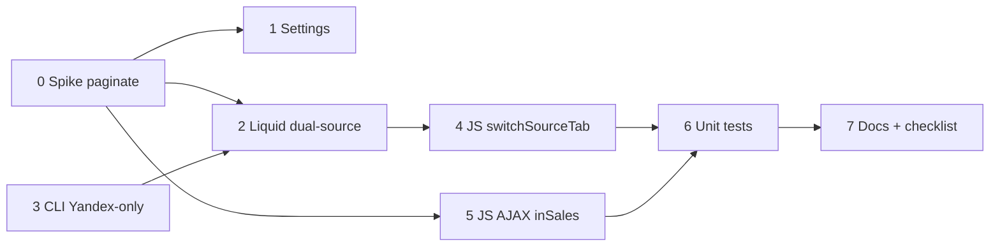

# План работ: DanForge Reviews Slider — dual-source architecture (Phase 2)

**ID задачи:** `2026-07-13-reviews-sources-refactor`  
**Дата:** 2026-07-13  
**Автор:** Планировщик  
**Статус:** черновик  
**Оценка суммарно:** 14–20 ч (без Phase 1 hotfix; Phase 3 lazy/optimize — отдельно)

## 1. Резюме

Миграция виджета `danforge_reviews_slider` на **dual-source architecture**:

- **InSales** — нативный Liquid (``), без REST API в стандартном CLI-run.
- **Яндекс** — CLI → snippet `danforge_reviews_yandex.liquid`, сортировка `created_at DESC`, без `random.shuffle`.
- **Вкладки** — `switchSourceTab()` с полным reinit pagination / Swiper / masonry / marquee; вкладка «Все» — merge по `data-sort-ts` DESC (tie-break: inSales перед yandex).
- **AJAX load-more** для inSales — по образцу `test/snippet.liquid` + `test/snippet.js`, с fallback если `paginate` недоступен.

**Phase 1 hotfix пропускаем** (assumption владельца): sort fix входит в задачу CLI Phase 2.

**Блокер до кодирования Liquid/AJAX:** spike paginate/prefetch (задача 0).

---

## 2. Зависимости

| Артефакт | Статус |
|----------|--------|
| `01-analysis.md` | ✅ |
| `02-spec.md` | ✅ draft v0.1 |
| `03-recommendation.md` | ✅ Phase 2 approved |
| `03-architecture.md` | — (упрощённый конвейер; архитектура в analysis + spec) |

**Внешние блокеры:**

- Подтверждение владельца: страница установки виджета у пилотного клиента (для spike URL).
- До завершения spike — не финализировать AJAX URL и `insales_prefetch_limit` fallback.

**Assumptions (до подтверждения владельца):**

1. Виджет может стоять на **любой** странице → spike + fallback без `paginate`.
2. Вкладка «Все» = **единый список**, merge по `data-sort-ts` DESC.
3. Phase 1 не делаем; сортировка Яндекс — в CLI Phase 2.

---

## 3. Граф зависимостей



---

## 4. Задачи

| # | Задача | Оценка | Зависит от | Статус |
|---|--------|--------|------------|--------|
| 0 | Spike: paginate / prefetch в контексте виджета | M (2 ч) | — | pending |
| 1 | Настройки: `insales_prefetch_limit`, `insales_ajax_loadmore`, help-тексты | S (0.5 ч) | 0 | pending |
| 2 | Liquid: prefetch inSales + partial карточки + include Yandex | L (4 ч) | 0, 1, 3* | pending |
| 3 | CLI: Yandex-only, sort desc, rename snippet | M (2.5 ч) | — | pending |
| 4 | JS: `switchSourceTab`, merge «Все», reinit subsystems | L (4 ч) | 2 | pending |
| 5 | JS: `loadInsalesPage` AJAX + интеграция load-more | M (2.5 ч) | 0, 2, 4 | pending |
| 6 | Unit-тесты + обновление fixtures | M (2 ч) | 3, 4, 5 | pending |
| 7 | Документация, migration guide, release checklist | S (1 ч) | 6 | pending |

\* Задача 2 может начать каркас partial до CLI, но финальный include Yandex — после задачи 3.

**Параллелизация:** задачи 0 и 3 — параллельно; после spike — 1 и 3; Liquid (2) и CLI (3) — частично параллельно.

---

## 5. Детализация задач

### Задача 0 — Spike: paginate / prefetch (M, 2 ч)

**Цель:** зафиксировать поведение платформы до реализации AJAX и выбора fallback.

**Шаги:**

1. Развернуть черновик виджета с минимальным prefetch-блоком на **трёх контекстах**:
   - главная (или landing, где стоит виджет у пилота);
   - `/collection/all` или аналог;
   - страница отзывов магазина (если есть в теме).
2. Проверить в Liquid/HTML:
   - доступность `paginate`, `paginate.current_page`, `paginate.next.url`;
   - `account.reviews_not_spam_count`, `account.reviews_enabled?`;
   - `sort: 'date_desc'` — порядок в HTML;
   - `blog.url` / альтернативный URL для AJAX (`request.path`, `page.url`).
3. Проверить prefetch в **editor_mode** (кэш, `enable_server_reload`).
4. Записать решение в `artifacts/.../spike-paginate-report.md` (или секция в этом плане после выполнения).

**DoD:**

- [ ] Таблица: контекст × paginate × prefetch count × sort order.
- [ ] Выбран **primary AJAX URL** и **fallback** (см. §5.5).
- [ ] Рекомендация по `insales_prefetch_limit` при отсутствии paginate.

**Fallback-матрица (принять по итогам spike):**

| Условие | Поведение |
|---------|-----------|
| `paginate` доступен | AJAX `?page=N` на URL текущей страницы (как test) |
| `paginate` недоступен | `insales_prefetch_limit` = max(`slider-limit`, `page-size`, 50); без server load-more; опционально CTA «Все отзывы» → страница отзывов |
| `insales_ajax_loadmore=false` | Только SSR prefetch, без кнопки |

---

### Задача 1 — Настройки (S, 0.5 ч)

**Файлы:** `widget/settings_form.json`, `widget/settings_data.json`

| name | type | default | enable_server_reload |
|------|------|---------|----------------------|
| `insales_prefetch_limit` | range 3–50 | = `page-size` (12) | true |
| `insales_ajax_loadmore` | checkbox | true | true |
| `yandex_prefetch_limit` | range 3–50 | 20 | false (подсказка для CLI `config.json`) |

**Изменения help-текстов:**

- `min_rating`: «InSales — фильтр на сервере (Liquid); Яндекс — при генерации CLI».
- `empty-message`: уточнить — «если нет отзывов выбранного источника».
- `page-size`: «Для inSales также влияет на prefetch, если `insales_prefetch_limit` не задан».

**Liquid assigns** в `snippet.liquid`:

```liquid

  {# parseBool pattern #}
```

**data-attrs на viewport:** `data-insales-count`, `data-insales-ajax-url` (если spike дал URL), `data-insales-ajax-enabled`.

**DoD:** ключи в `settings_data.json` совпадают с `name`; чекбоксы парсятся по правилам `insales-widgets.md`.

**Out of scope этой задачи:** `lazy_yandex` — Phase 3 (см. Gaps).

---

### Задача 2 — Liquid dual-source (L, 4 ч)

**Файлы:** `widget/snippet.liquid`, новый `widget/_df_review_card.liquid` (или snippet в теме — см. ниже)

**2.1 Assigns и условия (верх snippet.liquid):**

- `df_insales_count = account.reviews_not_spam_count`
- `reviews_start` — offset: при paginate `paginate.current_page * limit - limit`, иначе `0`
- `df_min_rating` — существующий парсер
- `df_hide_insales` / `df_hide_yandex` — без изменений семантики

**2.2 InSales block** (заменить ``):

```liquid

  
    
    
      
        
      
    
    
  

```

**2.3 Partial `_df_review_card.liquid`:**

- Единая разметка карточки для inSales (параметр `review`) и совместимость с полями CLI для Yandex (отдельный include или `source` branch).
- Атрибуты: `data-source="insales"`, `data-rating`, `data-sort-ts` (Unix или ISO — **единый формат для merge**), `data-photo-urls` при `review.image`.
- Schema.org attrs — сохранить как в `render_slide()`.
- Source label «InSales» / «Яндекс» — по `source`.

**2.4 Yandex block:**

```liquid

  
  
     Transition fallback (FR spec §8) 
    
  
  {{ yandex_markup }}

```

**2.5 Empty states (раздельно):**

- Только inSales пуст → empty inSales, Yandex может быть.
- Только Yandex пуст → empty Yandex.
- Оба пусты → `df-reviews__slide--empty` + `empty-message` + CTA форма (без изменений).

**2.6 Editor mode:** 1–2 placeholder-слайда inSales если count=0 (не ломать prefetch preview).

**2.7 AJAX markup** (если spike OK):

- Контейнер `[data-df-insales-pagination]` с кнопкой `[data-df-insales-loadmore]` и `data-url` (паттерн test:211–217).
- Рендерить только при `df_insales_ajax == true` и `df_insales_count > df_insales_limit`.

**2.8 Вкладки Liquid (FR-T6, FR-I8):**

- Скрыть таб InSales если `hide_insales` или `!account.reviews_enabled?` или count=0.
- Скрыть таб Яндекс если `hide_yandex` или snippet пуст.
- Если видим один таб — скрыть панель `[data-df-reviews-tabs]` целиком.

**DoD:**

- [ ] Нет `` как primary path.
- [ ] Все inSales-слайды имеют `data-sort-ts`.
- [ ] `min_rating` для inSales — только Liquid, без JS-remove.
- [ ] `hide_insales` / `hide_yandex` — блок не рендерится.

**Примечание:** partial может жить как фрагмент в `snippet.liquid` (capture) если inSales не позволяет отдельный widget-partial — Programmer выбирает по ограничениям gen-4; предпочтение — отдельный snippet в теме `df_review_card_insales.liquid` только если widget include недоступен.

---

### Задача 3 — CLI Yandex-only (M, 2.5 ч)

**Файлы:** `cli/get_reviews.py`, `cli/gui.py`, `cli/config.example.json`, `cli/INSTRUCTION.md`

| Изменение | Детали |
|-----------|--------|
| `SNIPPET_INNER_NAME` | `danforge_reviews_yandex.liquid` |
| `run()` | Убрать `fetch_insales_reviews` из standard path; Yandex-only |
| `sample_reviews()` | Только Yandex pool; deprecate `insales_ratio` / `sample_count` mix |
| Сортировка | `picked.sort(key=lambda r: r.created_at or '', reverse=True)` |
| Удалить | `random.shuffle(picked)` |
| `render_slide()` | Добавить `data-sort-ts="{{ unix or iso }}"`; `data-source="yandex"` |
| `generate_liquid()` | Header: «только Яндекс» |
| `write_outputs()` | `danforge_reviews_yandex.liquid`; cache — yandex only |
| `upload_snippet()` | Новое имя asset |
| Config | `yandex_limit` (default 20); `min_rating` фильтр при generate |
| `build_demo_output()` | Yandex-only demo (убрать insales demo или пометить deprecated) |
| Optional flag | `--insales-backup` — fetch API без upload, для диагностики |

**GUI:** пути output, кнопка «Копировать сниппет», labels.

**DoD:**

- [ ] Standard run не вызывает `/admin/reviews.json`.
- [ ] Порядок слайдов в output — строго desc по дате.
- [ ] Upload создаёт `danforge_reviews_yandex.liquid`.

---

### Задача 4 — JS `switchSourceTab` (L, 4 ч)

**Файл:** `widget/snippet.js`

**4.1 `filterSlides()` — refactor (FR + spec §7):**

- Убрать `slide.remove()` полностью.
- Для `hide_insales` / `hide_yandex` — no-op (уже не в DOM) или `is-hidden` для legacy mixed snippet.
- Для `min_rating` — только `is-hidden` на Yandex-слайдах (inSales отфильтрован в Liquid).

**4.2 Заменить `applySourceTab` → `switchSourceTab(root, source)`:**

```
1. root._dfActiveSourceTab = source
2. applySourceVisibility(root, source)  // wrapper + pool, is-hidden + display cleanup
3. if source === 'all' → mergeAllSourcesByDate(root)
   else → restoreDomSourceOrder(root)   // optional: undo merge reorder
4. reindexSlides(root)                 // data-df-slide-index 0..N-1
5. resetPaginationState(root)
6. applyModeLimits(root)               // slider-limit, spotlight-limit, marquee-limit
7. if layout uses pagination → applyPagination(root, { forceReset: true })
8. layout-specific reinit:
   - slider/spotlight: destroyExternalSwiper → initSlider/initSpotlight
   - masonry: scheduleMasonryLayout
   - marquee: resetMarqueeState → initMarquee
9. updateMoreButton(), renderPageControls()
10. if swiper exists → update OR full reinit per step 8
```

**4.3 `mergeAllSourcesByDate(root)` (FR-A1–A4):**

- Собрать слайды из wrapper + pool, не empty.
- Sort by `parseInt(data-sort-ts, 10)` DESC; tie-break: `data-source === 'insales'` before `yandex`.
- Reorder DOM nodes в wrapper (detach/append) — **один раз** при init и при switch на `all`.
- Переназначить `data-df-slide-index`.

**4.4 `applySourceVisibility` — pool-aware (FR-T5):**

- Селектор: `shell.querySelectorAll('.df-reviews__slide')` включая `[data-df-reviews-pool]`.
- Не трогать `df-reviews__slide--page-hidden` до шага pagination.

**4.5 `getOrderedSlides()` / `getActiveSlides()`:**

- Учитывать `root._dfActiveSourceTab` при подсчёте visible set для pagination.

**4.6 `initSourceTabs`:**

- На старте вызвать `switchSourceTab(root, 'all')` если tabs enabled (исправить порядок init).
- Порядок в `initWidget`: `initSourceTabs` → `switchSourceTab` **до** `initPagination` / Swiper init **или** force reset после pagination init.

**Рекомендуемый порядок init:**

```
filterSlides (is-hidden only)
→ initSourceTabs (bind)
→ switchSourceTab('all')   // merge + visibility
→ ensureSlideOrder
→ initPagination / initSlider / initMarquee
```

**DoD:**

- [ ] Смена вкладки сбрасывает на страницу 1 (FR-T3).
- [ ] Pool-слайды не «всплывают» при tab switch (FR-T5).
- [ ] Slider без пустых Swiper slides после filter.
- [ ] Все 6 layouts переключают источник без рассинхрона.

---

### Задача 5 — JS AJAX inSales (M, 2.5 ч)

**Файлы:** `widget/snippet.js`, `widget/snippet.liquid` (разметка кнопки)

**5.1 `loadInsalesPage(root, url)`** — по образцу `test/snippet.js:145–165`:

1. Disable button, loading state.
2. `fetch(url)` → parse HTML (`DOMParser`).
3. Extract: `.df-reviews__slide[data-source="insales"]` из wrapper виджета в ответе.
4. Append в `[data-df-reviews-wrapper]` (не дублировать по `data-review-id` если добавим id).
5. Update `[data-df-insales-pagination]` из ответа.
6. `reindexSlides` + если active tab insales/all → `switchSourceTab` partial refresh или `applyPagination`.
7. `migrateCardPhotos`, masonry relayout, lightbox rebind.

**5.2 Условия активации:**

- Только при `data-insales-ajax-enabled="true"`.
- Только на вкладках `insales` или `all` (на `yandex` — кнопка hidden).
- Не конфликтовать с client pagination pool для Yandex.

**5.3 Разделение load-more:**

- `[data-df-reviews-more]` — client pagination (Yandex / merged list) — существующая логика.
- `[data-df-insales-loadmore]` — server AJAX inSales — новая.

При active tab `all`: после AJAX merge по дате обязателен.

**DoD:**

- [ ] Подгрузка inSales без full page reload на странице с paginate.
- [ ] Fallback: кнопка не рендерится / disabled с tooltip при отсутствии paginate.

---

### Задача 6 — Unit-тесты (M, 2 ч)

**Новые/обновлённые файлы:**

| Файл | Что тестировать |
|------|-----------------|
| `widget/tests/source-tabs.test.js` | `mergeAllSourcesByDate` sort, tie-break, reindex |
| `widget/tests/pagination.test.js` | `resolvePaginationAction` после tab switch |
| `widget/tests/settings.test.js` | парс `insales_prefetch_limit`, `insales_ajax_loadmore` |
| `widget/tests/layouts.test.js` | fixtures с `data-sort-ts`, mixed sources |
| `widget/tests/visibility.html` | 3 таба, mixed slides |
| `cli/tests/test_cli_yandex_only.py` | no insales fetch mock, sort order, snippet name |

**Извлечь pure functions** из `snippet.js` для тестируемости (минимальный экспорт или duplicate logic в test helpers — по соглашению проекта).

**DoD:**

- [ ] `node widget/tests/*.test.js` — exit 0.
- [ ] `visibility.html` — PASS в браузере.
- [ ] Python CLI test green.

---

### Задача 7 — Документация (S, 1 ч)

**Файлы:** `README.md`, `CHANGELOG.md`, `cli/INSTRUCTION.md`, `templates/insales-widget-checklist.md` (пункты dual-source)

**Содержание:**

- Новый workflow: CLI только для Яндекс; inSales — автоматически.
- Migration: `danforge_reviews_slides.liquid` → deprecated; загрузить `danforge_reviews_yandex.liquid`; пересохранить виджет в редакторе.
- Release checklist: spike report, тест-матрица, upload обоих snippets при transition.

---

## 6. Порядок выполнения

1. **0** Spike paginate/prefetch → отчёт + решение fallback  
2. **3** CLI Yandex-only (параллельно с 0)  
3. **1** Settings  
4. **2** Liquid dual-source  
5. **4** JS switchSourceTab + merge  
6. **5** JS AJAX inSales  
7. **6** Unit tests  
8. **7** Docs + insales-widget-checklist  

---

## 7. Список файлов к изменению

| Файл | Действие |
|------|----------|
| `projects/df_reviews_slider/widget/snippet.liquid` | major — prefetch, dual include, AJAX markup, tabs visibility |
| `projects/df_reviews_slider/widget/snippet.js` | major — switchSourceTab, merge, AJAX, filterSlides |
| `projects/df_reviews_slider/widget/snippet.scss` | minor — insales load-more, tab empty states (если нужно) |
| `projects/df_reviews_slider/widget/settings_form.json` | add settings |
| `projects/df_reviews_slider/widget/settings_data.json` | defaults |
| `projects/df_reviews_slider/widget/_df_review_card.liquid` | **new** (или inline partial) |
| `projects/df_reviews_slider/cli/get_reviews.py` | major — Yandex-only pipeline |
| `projects/df_reviews_slider/cli/gui.py` | paths, labels |
| `projects/df_reviews_slider/cli/config.example.json` | yandex_limit |
| `projects/df_reviews_slider/cli/INSTRUCTION.md` | workflow |
| `projects/df_reviews_slider/README.md` | migration |
| `projects/df_reviews_slider/CHANGELOG.md` | entry |
| `projects/df_reviews_slider/widget/tests/source-tabs.test.js` | **new** |
| `projects/df_reviews_slider/widget/tests/pagination.test.js` | update |
| `projects/df_reviews_slider/widget/tests/layouts.test.js` | update fixtures |
| `projects/df_reviews_slider/widget/tests/visibility.html` | update |
| `projects/df_reviews_slider/cli/tests/test_cli_yandex_only.py` | **new** |
| `artifacts/.../spike-paginate-report.md` | **new** (задача 0) |

**Не менять в Phase 2:** `widget/info.json` (handle), форма отзыва (FR-I7), `snippet.scss` major refactor.

**Тема клиента (upload):**

- Создать `snippets/danforge_reviews_yandex.liquid`
- Оставить `danforge_reviews_slides.liquid` до миграции всех клиентов (transition fallback)

---

## 8. Тест-план

### 8.1 Unit-тесты (автоматические)

- [ ] `mergeAllSourcesByDate`: 3 yandex + 2 insales → порядок по ts desc; equal ts → insales first
- [ ] `switchSourceTab('yandex')`: visible count = только yandex; indices 0..n-1
- [ ] `switchSourceTab('all')` после yandex/insales switches → merged order stable
- [ ] `getTotalPages` после tab switch с разным visible count
- [ ] `resolvePaginationAction(forceReset)` при tab change
- [ ] CLI: output без insales; sort desc verified; no shuffle
- [ ] Settings parsers: `insales_prefetch_limit` fallback to page-size

**Команды:**

```bash
node projects/df_reviews_slider/widget/tests/settings.test.js
node projects/df_reviews_slider/widget/tests/settings-matrix.test.js
node projects/df_reviews_slider/widget/tests/layouts.test.js
node projects/df_reviews_slider/widget/tests/pagination.test.js
node projects/df_reviews_slider/widget/tests/source-tabs.test.js
python -m pytest projects/df_reviews_slider/cli/tests/
```

### 8.2 Ручная матрица (layouts × tabs)

**Окружения:** desktop (≥1024px), mobile (≤639px).  
**Данные:** ≥5 inSales + ≥5 Yandex, разные даты, пересечение дат для проверки tie-break.

| Layout | Tab: Все | Tab: InSales | Tab: Yandex |
|--------|----------|--------------|-------------|
| slider | ☐ порядок дат; Swiper без пустых; limit | ☐ только inSales; arrows | ☐ только yandex |
| spotlight | ☐ | ☐ | ☐ |
| masonry | ☐ relayout; load-more | ☐ AJAX inSales* | ☐ client load-more |
| grid | ☐ page nav count | ☐ | ☐ |
| list | ☐ load-more | ☐ AJAX* | ☐ |
| marquee | ☐ track rebuild | ☐ | ☐ |

\* AJAX — только если spike подтвердил paginate на тестовой странице.

**Дополнительные сценарии:**

- [ ] `hide_insales=true` — нет inSales в DOM; таб InSales скрыт
- [ ] `hide_yandex=true` — нет include yandex
- [ ] `source-tabs=false` — без панели; merged default view
- [ ] `min_rating=5` — inSales в Liquid; yandex в CLI
- [ ] 0 inSales / только Yandex / 0 обоих
- [ ] Editor: смена `display_mode`, `page-size`, `hide_*` — server reload
- [ ] Resize window — pagination page size mobile/desktop
- [ ] Transition: только старый `danforge_reviews_slides.liquid` в теме — fallback работает

### 8.3 Platform / Liquid

- [ ] Prefetch `sort: date_desc` на странице отзывов
- [ ] Prefetch на главной (fallback limit)
- [ ] `account.reviews_enabled? == false`
- [ ] Smoke `visibility.html`

### 8.4 Регрессия

- [ ] `insales-widget-checklist.md` — все пункты ON/OFF
- [ ] Форма «Оставить отзыв» — без регрессии
- [ ] Lightbox фото — inSales + yandex

---

## 9. Rollback strategy

### 9.1 Быстрый откат (production incident)

1. **Виджет:** откатить `snippet.liquid` + `snippet.js` + `settings_form.json` к предыдущей версии из git; перезалить в inSales.
2. **Тема:** восстановить `` в snippet (старая ветка Liquid).
3. **CLI:** запустить предыдущую версию `get_reviews.py` с mix mode → регенерировать `danforge_reviews_slides.liquid` → upload.
4. **Пересохранить** виджет в редакторе inSales.

**Время отката:** ~30 мин (без потери данных отзывов).

### 9.2 Частичный откат (dual-source Liquid OK, JS tabs broken)

- Временно `source-tabs=false` в settings клиента.
- `hide_yandex=true` или `hide_insales=true` — показ одного источника без tab logic.

### 9.3 Transition period

- Держать **оба** snippet в теме: `danforge_reviews_yandex.liquid` (new) + `danforge_reviews_slides.liquid` (legacy).
- Liquid fallback на старый snippet если yandex пуст (spec §8).
- После стабилизации Phase 3 — удалить legacy snippet и fallback code.

### 9.4 Данные

- inSales отзывы не зависят от CLI — откат JS/Liquid не удаляет отзывы.
- Yandex кэш: `reviews_cache.json` — backup перед первым Yandex-only run.

---

## 10. Критерии готовности (Definition of Done)

- [ ] Spike report завершён; fallback задокументирован
- [ ] FR-I1–I5, FR-Y1–Y6, FR-T1–T7, FR-A1–A4, FR-S1–S4 из `02-spec.md` — покрыты или явно в Gaps
- [ ] Код прошёл Code Reviewer APPROVED
- [ ] Unit-тесты green; ручная матрица пройдена на пилотном магазине
- [ ] README / INSTRUCTION / CHANGELOG обновлены
- [ ] `insales-widget-checklist.md` подписан
- [ ] Артефакты: `04-plan.md` (этот файл), spike report

---

## 11. Риски и неопределённости

| # | Риск | Вероятность | План B |
|---|------|-------------|--------|
| 1 | `paginate` недоступен на главной | Средняя | Больший prefetch + CTA; отключить AJAX |
| 2 | Regression 6 layouts × 3 tabs | Высокая | Матрица §8.2; поэтапный rollout одному клиенту |
| 3 | Merge «Все» + AJAX ломает индексы | Средняя | Re-run merge после каждого AJAX append |
| 4 | Старые клиенты без yandex snippet | Средняя | Fallback `danforge_reviews_slides` 1 release |
| 5 | Editor prefetch cache | Средняя | `enable_server_reload`; smoke editor_mode |

---

## 12. Gaps / open items

*Self-review плана против `02-spec.md` (v0.1). Требуют подтверждения владельца или Phase 3.*

| ID | Spec ref | Gap | Решение в плане |
|----|----------|-----|-----------------|
| G1 | FR-I6 | Ответ менеджера inSales | **Out of scope** — не в задачах Phase 2 |
| G2 | §6.1 `lazy_yandex` | Отложенная загрузка Yandex по клику | **Phase 3** — настройка не добавляется в задачу 1; SSR include в Phase 2 |
| G3 | §8 EventBus | Reload после `send-review:insales` | **Phase 3** — optional reload block не в задачах |
| G4 | Open Q1 (analysis) | Точная страница установки пилота | **Блокер spike** — задача 0 |
| G5 | FR-T6 | Один видимый таб — скрыть панель | В задаче 2.8; нужна ручная проверка edge case |
| G6 | NFR-1 FCP +20% | Не измеряется в плане | Добавить ручной Lighthouse до/после на пилоте (задача 6/7) |
| G7 | `data-sort-ts` format | Spec не фиксирует Unix vs ISO | Programmer: Unix seconds в Liquid (`date: '%s'`) и CLI — единый контракт |
| G8 | Partial location | Spec: `_df_review_card.liquid`; gen-4 widget limits | Programmer уточняет: widget partial vs theme snippet |
| G9 | `yandex_prefetch_limit` | Только подсказка CLI, не widget setting | В задаче 1 без server reload — OK по spec |
| G10 | Spec Review gate | `02-spec.md` draft v0.1 | Рекомендуется APPROVED от Spec Reviewer до Programmer (конвейер) |
| G11 | Product-level reviews | Out of scope §11 | Не планируется |
| G12 | AJAX на tab «Все» | Spec §4.3 — pagination по merged list | Задача 5: merge после AJAX; **сложный edge** — выделить отдельный manual test |

**Подтвердить у владельца:**

1. Страница виджета пилотного клиента (для spike).
2. CTA fallback «Все отзывы на отдельной странице» — нужен ли URL в настройках (`reviews-page-url`)?
3. Удалять ли `danforge_reviews_slides.liquid` сразу после миграции пилота или держать 1 релиз.

---

## 13. Следующий шаг конвейера

**Plan Reviewer** → вердикт APPROVED / NEEDS_REVISION → **Programmer** (задачи 0→7) → **Code Reviewer** + `templates/insales-widget-checklist.md`
