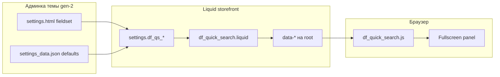
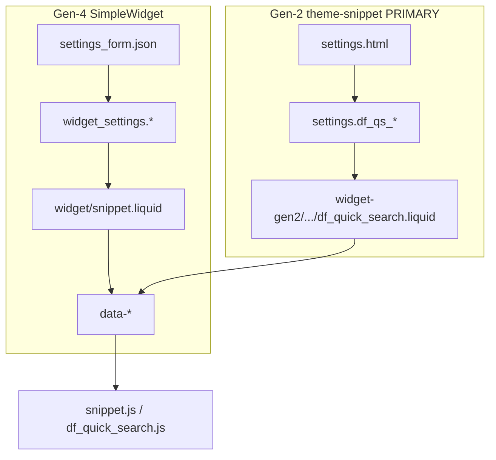

# Архитектура: gen-2 поставка df_quick_search

**ID задачи:** `2026-07-23-df-quick-search-gen2`  
**Дата:** 2026-07-23  
**Автор:** Архитектор  
**Статус:** на ревью  
**База:** `01-analysis.md` (Analyst) + решения Jarvis (ADR ниже)  
**ТЗ:** отдельного `02-spec.md` нет — AC и scope взяты из анализа + решений Jarvis

---

## 1. Цель и границы

### Цель

Отдельная **theme-snippet** поставка быстрого поиска DanForge для inSales **generation 2** (паттерн nivona: `settings.html` + `settings.*` + include в layout), с **паритетом всех 21 настроек** gen-4 и тем же JS-ядром через идентичный контракт `data-*`.

### In scope

- Пакет `projects/df_quick_search/widget-gen2/` (см. §3).
- Liquid-адаптер: `settings.df_qs_*` → те же `data-*`, что gen-4.
- Блок fieldset для `config/settings.html` + ключи дефолтов для `settings_data.json`.
- Assets: JS (reuse `widget/snippet.js`) + отдельный CSS в `media/`.
- Документация установки (чеклист; полный текст — в плане / docs).
- Дефолт `trigger_selectors` с добавлением nivona-селекторов (`.header_search` и др.) к списку gen-4.
- SimpleWidget `widget/info.gen2.json` **оставить как есть** (редкие зоны) — не основной продукт.

### Out of scope

- Изменения рабочей поставки gen-4 `widget/` (v1.0.0) — **не ломать**.
- Live preview / CSS vars на `.layout` (только gen-4 editor).
- Hybrid SimpleWidget + widget_lists как primary (отклонён Jarvis; reviews-прецедент не копируем для QS).
- Форк логики поиска / новый API / правки `media/search.js` темы.
- Checkout / account layouts (QS не ставим туда по умолчанию).
- Автоматический ZIP/CI publish (ручная установка клиентом).

---

## 2. Резюме решения

**Primary delivery = theme-snippet пакет** в `widget-gen2/` рядом с `widget/`. Настройки темы (`df_qs_*`) → Liquid пишет gen-4-совместимые `data-*` → **тот же** `snippet.js`. CSS — отдельный файл в `media/`, линк из сниппета. SimpleWidget gen-2 остаётся запасным каналом в `widget/`, не в фокусе GTM.

---

## 3. Структура папок поставки

**Выбор имени: `widget-gen2/`** (не `gen2/`).

| Критерий | `widget-gen2/` | `gen2/` |
|----------|----------------|---------|
| Рядом с `widget/` | явно «вторая упаковка того же продукта» | короче, но двусмысленно |
| Не путать с отдельным репо | да (`df_reviews_slider_gen2` — другой продукт) | похоже на «поколение платформы» |
| Upload/копирование клиентом | префикс `widget-` = артефакт поставки | легко спутать с platform gen |

```
projects/df_quick_search/
├── widget/                          # gen-4 — НЕ менять в рамках этой задачи
│   ├── snippet.js                   # SSOT JS
│   ├── snippet.scss                 # SSOT стилей (источник)
│   ├── snippet.liquid
│   ├── settings_form.json
│   ├── info.json / info.gen4.json / info.gen2.json
│   └── …
├── widget-gen2/                     # ★ primary gen-2 поставка
│   ├── README.md                    # отличие от gen-4, ссылка на install
│   ├── docs/
│   │   └── install.md               # чеклист установки (nivona-паттерн)
│   ├── snippets/
│   │   └── df_quick_search.liquid   # адаптер settings.df_qs_* → data-*
│   ├── config/
│   │   ├── settings_fieldset.html   # готовый <fieldset> для вставки в settings.html
│   │   └── settings_data.keys.json  # фрагмент ключей presets.current для merge
│   ├── media/
│   │   ├── df_quick_search.js       # копия/синк с widget/snippet.js (без форка логики)
│   │   ├── df_quick_search.css      # собранный CSS для ручной заливки в media темы
│   │   └── df_quick_search.scss     # опционально: копия widget/snippet.scss для сопровождения
│   └── patches/                     # справочные фрагменты (не автопатч)
│       └── layouts.layout.include.liquid.txt
└── README.md                        # обновить секцию Gen-2 → указать widget-gen2
```

**Правило синка:** `widget-gen2/media/df_quick_search.js` = побайтово/логически тот же код, что `widget/snippet.js`. При релизе gen-4 JS — копировать в gen-2 пакет (один diff-чеклист в README). Форк логики запрещён без явного ADR.

---

## 4. Компоненты

| Компонент | Роль | Технология |
|-----------|------|------------|
| `df_quick_search.liquid` | Markup панели + assign из `settings.df_qs_*` + `data-*` + link/script assets | Liquid |
| `settings_fieldset.html` | UI 21 настройки в админке темы | HTML fieldset/table (паттерн nivona) |
| `settings_data.keys.json` | Дефолты `df_qs_*` | JSON merge в `presets.current` |
| `df_quick_search.js` | Поведение панели (reuse) | JS IIFE из gen-4 |
| `df_quick_search.css` | Стили панели (не platform-scss) | CSS в `media/` |
| `docs/install.md` | Установка клиентом | Markdown |
| `widget/info.gen2.json` | Запасной SimpleWidget-канал | без изменений в этой задаче |

### CSS: выбранный вариант

**Отдельный asset `df_quick_search.css` в `media/` темы + `<link>` внутри Liquid-сниппета.**

| Вариант | Вердикт |
|---------|---------|
| A. Только platform `snippet.scss` | ❌ нет платформенной сборки при theme-include |
| B. Влить в `theme.css` / `theme.scss` | ❌ хрупко при обновлениях темы клиента |
| C. **Отдельный CSS + link в сниппете** | ✅ один include тянет стили; клиент заливает 1 файл в media |
| D. Весь CSS inline в Liquid | ❌ раздувает snippet; дубль с gen-4 scss |

Критичные overlay/panel правила из gen-4 `<style>` в `snippet.liquid` — **перенести в `df_quick_search.css`** (единый файл), чтобы gen-2 сниппет не дублировал огромный inline-блок. Если Programmer оставит минимальный critical inline — допустимо, но предпочтение: всё в CSS.

Подключение JS: `<script src="{{ 'df_quick_search.js' | asset_url }}" defer></script>` в конце сниппета (после root-разметки). Альтернатива — строка в `scripts.liquid` — хуже (лишний шаг установки).

### Ключи settings

Префикс **`df_qs_`** (без коллизий с темой). Полная матрица — §6 и таблица Analyst §4.

---

## 5. Поток данных



Сравнение каналов:



---

## 6. Контракт data-* (паритет gen-4)

Liquid gen-2 пишет **те же** атрибуты и значения (`'true'` / `'false'` / строки / числа), что gen-4 `snippet.liquid`. JS читает `root.dataset.*` (camelCase).

| # | `settings.df_qs_*` | `data-*` атрибут | `dataset` в JS | Default gen-2 |
|---|--------------------|------------------|----------------|---------------|
| 1 | `df_qs_enabled` | `data-enabled` | `enabled` | `"1"` → `'true'` |
| 2 | `df_qs_placeholder` | `data-placeholder` | `placeholder` | `Поиск по каталогу` |
| 3 | `df_qs_popular_queries` | `data-popular-queries` | `popularQueries` | `""` |
| 4 | `df_qs_trigger_selectors` | `data-trigger-selectors` | `triggerSelectors` | см. §6.1 |
| 5 | `df_qs_show_photos` | `data-show-photos` | `showPhotos` | `"1"` → `'true'` |
| 6 | `df_qs_show_out_of_stock_badge` | `data-show-out-of-stock-badge` | `showOutOfStockBadge` | `"1"` → `'true'` |
| 7 | `df_qs_show_prices` | `data-show-prices` | `showPrices` | `"1"` → `'true'` |
| 8 | `df_qs_show_product_sort` | `data-show-product-sort` | `showProductSort` | `"1"` → `'true'` |
| 9 | `df_qs_show_all_results` | `data-show-all-results` | `showAllResults` | `"1"` → `'true'` |
| 10 | `df_qs_show_categories` | `data-show-categories` | `showCategories` | `"1"` → `'true'` |
| 11 | `df_qs_show_articles` | `data-show-articles` | `showArticles` | absent → `'false'` |
| 12 | `df_qs_articles_lazy_load` | `data-articles-lazy-load` | `articlesLazyLoad` | `"1"` → `'true'` |
| 13 | `df_qs_article_blog_handles` | `data-article-blog-handles` | `articleBlogHandles` | `blog` |
| 14 | `df_qs_articles_display_limit` | `data-articles-display-limit` | `articlesDisplayLimit` | `8` |
| 15 | `df_qs_articles_blog_url` | `data-articles-blog-url` | `articlesBlogUrl` | `/blog` |
| 16 | `df_qs_hide_zero_price` | `data-hide-zero-price` | `hideZeroPrice` | absent → `'false'` |
| 17 | `df_qs_results_limit` | `data-results-limit` | `resultsLimit` | `24` |
| 18 | `df_qs_image_ratio` | `data-image-ratio` | `imageRatio` | `square` |
| 19 | `df_qs_cols_mobile` | `data-cols-mobile` | `colsMobile` | `2` |
| 20 | `df_qs_cols_tablet` | `data-cols-tablet` | `colsTablet` | `3` |
| 21 | `df_qs_cols_desktop` | `data-cols-desktop` | `colsDesktop` | `4` |

Дополнительно (как в gen-4, не из settings UI): `data-articles-server-total`, `data-articles-cache-key`, CSS vars `--df-qs-cols-*`, JSON scripts collections/articles.

Корневые маркеры без изменений: `data-df-quick-search-root`, `data-danforge-widget="danforge_quick_search"`.

### 6.1 Default `trigger_selectors` (gen-2)

Объединение gen-4 (armedf) + nivona:

```
.header__search, .header__search-form, .header__search-field, .header__search-btn, .js-open-search-panel, .js-show-search, .header_search, .header_search form, #header-search, .header_search button
```

В `settings_data` и Liquid `| default:` — эта строка. Gen-4 `settings_form` / `widget/` **не менять**.

---

## 7. Checkbox-семантика gen-2

### Хранение (тема)

| Состояние | `settings_data` / runtime |
|-----------|---------------------------|
| Вкл | `"1"` |
| Выкл | ключ **отсутствует** или пустая строка |

Не опираться на boolean `true`/`false` как в `widget_settings` gen-4.

### Парсинг в Liquid (адаптер)

**Default-ON** (`enabled`, `show_photos`, …, `articles_lazy_load`):

```liquid


  

```

Смысл: после merge дефолтов `"1"` в `settings_data` — включено; снятие галочки → absent → выкл.  
**Важно:** дефолты `"1"` для default-ON **обязательны** в `settings_data.keys.json`, иначе первый визит без ключа даст OFF.

**Default-OFF** (`show_articles`, `hide_zero_price`):

```liquid


  

```

На выходе в DOM всегда `'true'` / `'false'` — совместимо с `parseBool` в JS (`'true'|'false'|'1'|'0'`).

Не копировать gen-4 проверки `== false or == 'false'` как единственный путь — для theme settings они недостаточны.

---

## 8. Куда вставлять include (nivona-паттерн)

### Рекомендация

**Файл:** `templates/layouts.layout.liquid`  
**Место:** после ``, **перед** ``:

```liquid



```

### Почему

| Вариант | Оценка |
|---------|--------|
| Внутри `header.liquid` рядом с `.header_search` | ❌ панель — global overlay; header может отличаться; риск дублей |
| Сразу после `header` | допустимо, но overlay лучше ближе к концу `body` |
| **Перед `scripts`** | ✅ один экземпляр на storefront; DOM готов до/к deferred JS |
| В `index.liquid` / page templates | ❌ не на всех страницах |
| `layouts.checkout*.liquid` / `client_account` | ❌ out of scope по умолчанию |

Файл сниппета в теме: `snippets/df_quick_search.liquid` (копия из пакета).

Менять разметку `.header_search` **не нужно** — только селекторы + capture intercept в JS (как gen-4).

---

## 9. Переиспользование vs дублирование

| Артефакт | Shared / SSOT | В gen-2 пакете |
|----------|---------------|----------------|
| Логика поиска, UI, API | `widget/snippet.js` | Копия → `media/df_quick_search.js` (sync, не fork) |
| Стили | `widget/snippet.scss` | Сборка → `media/df_quick_search.css` (+ опц. scss-копия) |
| Markup + data-* контракт | идея общая | **Fork Liquid**: только источник settings |
| 21 настройка (смысл) | `settings_form.json` как спека | Параллельный UI в `settings_fieldset.html` |
| Unit-тесты парсеров | `widget/tests/` | Переиспользовать как есть (контракт data-* тот же) |
| `info.gen2.json` | остаётся в `widget/` | Не входит в primary поставку |

**Запрещено:** расхождение `data-*` имён/семантики между двумя Liquid. При добавлении настройки gen-4 — обновить оба адаптера в одном релизе.

---

## 10. Чеклист установки (кратко)

Полный текст — `widget-gen2/docs/install.md` (Plan/Programmer). Кратко:

1. Залить в тему `snippets/df_quick_search.liquid`.
2. Залить в `media/`: `df_quick_search.js`, `df_quick_search.css`.
3. Вставить fieldset из `config/settings_fieldset.html` в `config/settings.html`.
4. Добавить ключи из `config/settings_data.keys.json` в `presets.current` → `settings_data.json`.
5. Include в `layouts.layout.liquid` (перед `scripts`), **не** в checkout.
6. Опубликовать тему; smoke: клик по `.header_search` → панель; `enabled` OFF → скрыт; Enter → `/search?q=…`.

---

## 11. Риски и митигации

| Риск | Митигация |
|------|-----------|
| Нет include → «поиск не работает» | Явный шаг в install + DoD smoke |
| Checkbox OFF ломается из‑за wrong parse | Контракт §7 + дефолты `"1"` в settings_data |
| Submit формы шапки уводит на `/search` | JS intercept (как gen-4); триггеры включают form/button |
| Рассинхрон JS gen-4 ↔ gen-2 | SSOT + чеклист копии при релизе |
| `` отсутствует на части gen-2 | Обернуть articles-индекс: при ошибке/неподдержке — без cache (fallback без тега или документировать проверку); не блокировать весь виджет |
| Дубль root при двух include | Документ: ровно один include; JS идемпотентен через ready-флаг |
| Коллизии имён settings | Только префикс `df_qs_` |
| Клиент правит CSS темы и ломает z-index | Высокие z-index как в gen-4; не править theme.css |
| SimpleWidget gen-2 путают с primary | README: primary = `widget-gen2/`; info.gen2 — редкие зоны |

---

## 12. Открытые вопросы для владельца

**Нет блокеров.** Решения Jarvis закрывают primary channel, паритет 21, reuse JS, папку, CSS, триггеры, неломание gen-4.

Неблокирующие (можно уточнить позже, не стопают реализацию):

- Пилот-магазин = nivona.ru (принято как референс дефолтов).
- Процесс обновлений у клиента — вручную (заложено в install docs).

---

## 13. Definition of Done (реализация)

- [ ] Существует `projects/df_quick_search/widget-gen2/` по дереву §3.
- [ ] Liquid-адаптер пишет полный контракт §6; checkbox по §7.
- [ ] Default `trigger_selectors` включает nivona + gen-4 список (§6.1).
- [ ] `df_quick_search.js` синхронизирован с `widget/snippet.js` (без логического форка).
- [ ] `df_quick_search.css` покрывает стили gen-4 (scss → css); подключение из сниппета.
- [ ] `settings_fieldset.html` — все 21 поля; `settings_data.keys.json` — согласованные дефолты.
- [ ] `docs/install.md` с шагами §10.
- [ ] `widget/` gen-4 не изменён (кроме возможно ссылки в корневом README на gen-2 пакет).
- [ ] Unit-тесты парсеров gen-4 зелёные; smoke-чеклист по nivona-паттерну описан.
- [ ] Arch Reviewer: **APPROVED** перед Planner.

---

## 14. Принятые решения (ADR)

### ADR-1: Primary delivery = theme-snippet (вариант B)

- **Статус:** принято (Jarvis)
- **Решение:** основной gen-2 продукт — пакет theme snippets + `settings.html`, не SimpleWidget.
- **Следствие:** `info.gen2.json` в `widget/` сохраняется для редких зон с widget lists, но не GTM-primary.

### ADR-2: Паритет 21 настроек

- **Статус:** принято (Jarvis)
- **Решение:** без урезания MVP; полный fieldset.

### ADR-3: Максимальный reuse JS

- **Статус:** принято (Jarvis)
- **Решение:** один SSOT `widget/snippet.js`; Liquid gen-2 только меняет источник настроек → те же `data-*`.

### ADR-4: Папка `widget-gen2/`

- **Статус:** принято (Architect)
- **Решение:** `projects/df_quick_search/widget-gen2/` рядом с `widget/`.
- **Альтернатива отклонена:** `gen2/` — менее ясно относительно продукта.

### ADR-5: CSS как media-asset + link в snippet

- **Статус:** принято (Architect)
- **Решение:** `df_quick_search.css` в media темы; `<link … asset_url>` в сниппете.
- **Альтернативы отклонены:** вливание в theme.css; только inline; надежда на platform scss.

### ADR-6: Расширенный default trigger_selectors

- **Статус:** принято (Jarvis)
- **Решение:** к gen-4 списку добавить `.header_search`, `.header_search form`, `#header-search`, `.header_search button`. Только в gen-2 дефолтах.

### ADR-7: Не ломать gen-4 `widget/`

- **Статус:** принято (Jarvis)
- **Решение:** изменения v1.0.0 SimpleWidget вне scope; sync JS — копирование в gen-2, не рефакторинг API ради gen-2.

---

## 15. Альтернативы (сводка)

| Альтернатива | Почему отклонена |
|--------------|------------------|
| A — только SimpleWidget (`info.gen2.json`) | Нет header/outside; на nivona-like без zones не появляется |
| C — Hybrid upload + widget_lists | Для QS всё равно нужен layout include; сложнее B |
| Dual-read в одном `snippet.liquid` | Риск регрессии gen-4; Jarvis: отдельная поставка |
| Форк `snippet.js` под gen-2 | Нарушает reuse; дрейф фич |

---

## 16. Связанные артефакты

- Анализ: `artifacts/2026-07-23-df-quick-search-gen2/01-analysis.md`
- Gen-4 виджет: `projects/df_quick_search/widget/`
- Референс тема: `projects/Пример 2 поколения/nivona.ru/`
- Прецедент (не копировать hybrid): `projects/df_reviews_slider_gen2/docs/nivona-install.md`
- Стек: `knowledge/stack-preferences.md`
- Knowledge widgets (частично): `knowledge/platforms/insales-widgets.md`

---

## 17. Файлы, которые создаёт Programmer

| Путь | Действие |
|------|----------|
| `projects/df_quick_search/widget-gen2/README.md` | создать |
| `projects/df_quick_search/widget-gen2/docs/install.md` | создать |
| `projects/df_quick_search/widget-gen2/snippets/df_quick_search.liquid` | создать (адаптер) |
| `projects/df_quick_search/widget-gen2/config/settings_fieldset.html` | создать |
| `projects/df_quick_search/widget-gen2/config/settings_data.keys.json` | создать |
| `projects/df_quick_search/widget-gen2/media/df_quick_search.js` | создать (копия `widget/snippet.js`) |
| `projects/df_quick_search/widget-gen2/media/df_quick_search.css` | создать (из `snippet.scss` + critical styles) |
| `projects/df_quick_search/widget-gen2/media/df_quick_search.scss` | опционально (копия источника) |
| `projects/df_quick_search/widget-gen2/patches/layouts.layout.include.liquid.txt` | создать (фрагмент include) |
| `projects/df_quick_search/README.md` | обновить секцию Gen-2 → указать primary `widget-gen2/` |

**Не создавать/не менять в этой задаче:** содержимое `widget/snippet.*`, `settings_form.json`, `info*.json` (кроме упоминания в корневом README).
