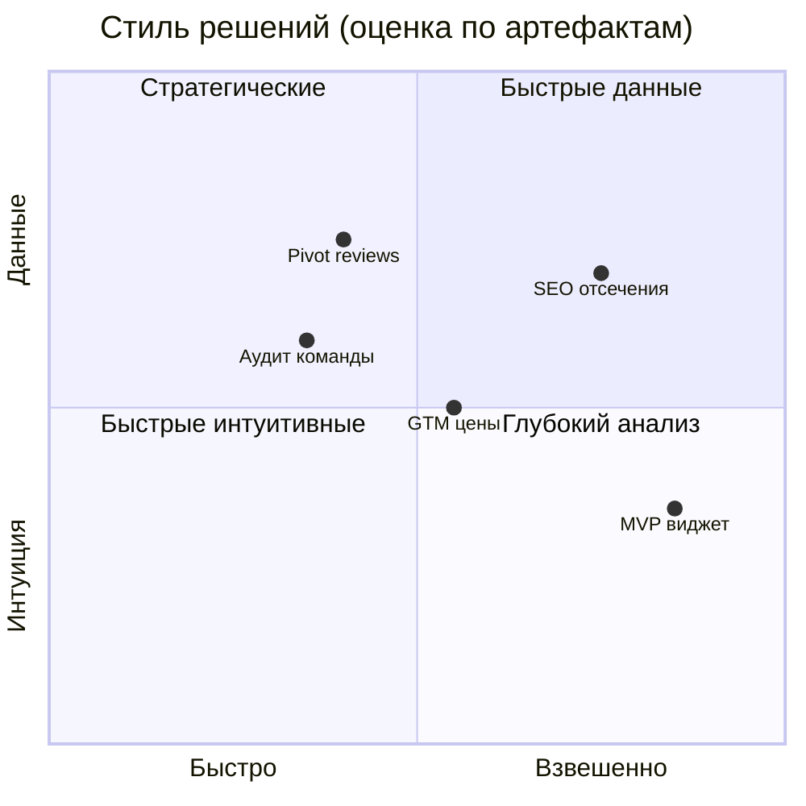

# Анализ владельца: стиль работы с ИИ-командой

**Дата:** 2026-07-27  
**Субъект:** Даниил (владелец DanForge)  
**Источники:** артефакты июль 2026, ретро reviews/quick search, ADR, owner-decisions, history-with-previous-ai, текущий чат

---

## Executive summary

Вы — **прагматичный product-owner с техническим бэкграундом**. Даёте задачи через Jarvis в формате **живой сессии**: старт → итерации после тестов → решения по бизнесу. Сильные стороны — скорость, отсечение лишнего, понимание inSales. Главные риски для команды — **ручные правки виджета без синхронизации** и **давление на скорость в ущерб gates** на старте MVP.

**Оценка взаимодействия:** 8/10 — вы даёте команде то, что нужно продуктовой студии: цель, обратная связь, решения. Процессные шероховатости в основном закрыты owner-playbook и owner-edit-protocol.

---

## Как вы отдаёте команды

### Паттерн «сессия»

| Этап | Ваш стиль | Оценка |
|------|-----------|--------|
| Старт | «Делаем виджет X» (с @jarvis или без) | ✅ Естественно, не перегружаете ТЗ |
| Итерации | Короткие сообщения после тестов | ✅ Идеально для agile-цикла |
| Уточнения | Скрины, HTML, «не работает в превью» | ✅ Ценный контекст |
| Закрытие | «Ок» / «обнови README» / публикация сами | ✅ Чёткое разделение ролей |

**Вывод:** не нужно менять стиль. Команда адаптирована: **все сообщения = Jarvis**.

### Типичные формулировки (реконструкция по артефактам)

- **Продукт:** «делаем виджет …», «добавь макет», «dual-source»
- **Баг:** симптом + магазин (armedf, myshop)
- **Бизнес:** «не делаем перелинковку», «alt отложим», «Kwork в hero не нужен»
- **Стратегия:** «давай обсудим», «ретро», «что с командой на новом устройстве»
- **Процесс:** ввели подписи ролей (11.07), запросили аудит команды (27.07)

### Чего вы обычно не делаете (и это нормально)

- Не пишете длинные ТЗ заранее — Analyst достраивает
- Не вызываете Programmer/SEO по имени
- Не требуете формальные review-отчёты в чате — читаете результат

---

## Сильные стороны как владельца

### 1. Продуктовые решения с ясной логикой

Примеры из `00-owner-decisions.md`, GTM, pivot 20.07:

- Нет вкладки «Все» — убрали лишнюю сложность
- Phase 1 hotfix пропустить — сэкономили двойную работу
- Pivot продаж: база клиентов не приоритет → контент + CLI + gen-2
- Цены reviews: модель A с manual tier — осознанная монетизация

**Эффект:** команда не тонет в ветвлениях; есть файл решений.

### 2. Жёсткий ROI-фильтр

`05-owner-decisions-handoff.md` (SEO):

- ❌ Перелинковка «Другие модули»
- ❌ Kwork в hero
- ⏸ Alt у скринов — «потом, слабый ROI»
- ✅ H1, JSON-LD, sitemap — сделано

**Эффект:** команда не тратит время на низкоотдачные SEO-задачи. Это зрелое поведение владельца.

### 3. Техническая вовлечённость

- Сами правите `settings_form.json`, labels, defaults в админке (14.07)
- Деплой на armedf, smoke в реальном магазине
- Понимаете gen-2 vs gen-4, masonry vs prefetch

**Эффект:** быстрые продуктовые улучшения UX в админке.  
**Риск:** см. раздел «Зоны роста».

### 4. Обратная связь через реальность, не абстракции

- HTML `data-*` с клиента → быстрые фиксы 10.07
- armedf curl → поняли лимит пагинации InSales
- Тесты в редакторе inSales, не только unit

### 5. Развитие процесса

- Инициировали подписи ролей (`team-response-format.md`)
- Запросили аудит команды и owner-playbook
- Согласились на gates «жёсткие, кроме hotfix» (13.07)

---

## Зоны роста (не критика — синхронизация)

### 1. Owner edits без уведомления

**Факт:** 14.07 — 6 файлов widget изменены вами; русские labels сломали `parseLayout` до фикса 15.07.

| Было | Рекомендация |
|------|--------------|
| Правки в админке → заливка в repo молча | Одна строка: «Owner edit: armedf, переименовал вкладки» |
| Команда узнаёт по багу | Jarvis фиксирует `01-owner-changes.md` до кода |

Вы **хорошо** правите продукт — нужен только **сигнал** команде.

### 2. Скорость MVP vs gates (исторически)

Reviews 09–10.07: обход Plan/Code Review → ~60% времени на баги.  
Вы не единственная причина — но давление «сделать быстрее» типично для владельца-разработчика.

**Сейчас:** gen2 quick search с APPROVED gates — эталон. При срочности используйте явно: `пропустить gate: …`.

### 3. Git-снимки в `projects/`

Ретро 15.07: репо без коммитов → сложно отличить ваши правки от команды.

**Рекомендация:** после логической порции (ваш edit / багфикс батч) — просить Jarvis: «сделай snapshot commit» или делать сами.

### 4. Метрики и KPI

`kpi-targets.md`, `monthly-log.md` — пустые. Вы принимаете решения по ощущениям и Метрике, но команда не видит цифры в KB.

**Рекомендация:** раз в месяц 15 мин — одна строка в `monthly-log.md` (заявки, продажи виджетов, Kwork просмотры).

### 5. Публикация отстаёт от кода

Паттерн: код и упаковка готовы → live-check pending (цены quick search, скрины reviews).

Это не ошибка — **ваша зона**. Команда может пинговать: «блокер GTM — публикация».

---

## Матрица: кто что делает (как вы уже работаете)

| Зона | Вы | Команда |
|------|-----|---------|
| Цель и приоритет | ✅ | предлагает, вы режете |
| Архитектура продукта | ✅ ключевые решения | проектирует детали |
| Код виджета | иногда руками | основной объём |
| Тесты в inSales | ✅ smoke | unit/e2e |
| Tilda / Kwork live | ✅ | тексты, SEO, инструкции |
| Цены и пакеты | ✅ | черновики |
| Доступы, деплой | ✅ | runbook |

Разделение **здоровое**. Не нужно отдавать Tilda команде — это невозможно технически.

---

## Ваш профиль принятия решений

- **Операционка** — быстро, часто по опыту inSales
- **Стратегия** — готовы к совещанию, слушаете анализ, фиксируете ADR
- **Отказ от идей** — чёткий, без сожаления (лид-магнит аудит, перелинковка)

---

## Рекомендации вам (короткий чеклист)

### Делать как сейчас

- Сессия в одном чате, короткие follow-up
- Резать слабый ROI без объяснений длиннее одного предложения
- Приносить скрины и HTML с live-магазинов
- Стратегические «давай обсудим» без кода

### Добавить минимум усилий

1. **После правок в админке** — одна строка `Owner edit: …` (можно без @jarvis)
2. **Новая тема в том же чате** — «Новая тема: …» чтобы не смешивать виджеты
3. **Раз в месяц** — строка в `monthly-log.md`
4. **Срочно без плана** — явно `пропустить gate: …` (не молча)

### Не обязательно менять

- Писать `@jarvis` каждый раз
- Писать длинные ТЗ до старта
- Вызывать роли по имени

---

## Рекомендации команде (как работать с вами)

| Ситуация | Действие Jarvis |
|----------|-----------------|
| Короткое сообщение без контекста | Считать продолжением текущей задачи |
| Сообщение без @jarvis | Всё равно Jarvis отвечает |
| Владелец правил админку | Спросить один раз: «это owner edit?» → протокол |
| Владелец говорит «не делаем» | Записать в decisions, не спорить без данных |
| Долгая пауза в чате | При возобновлении — 1 строка recap задачи |
| Владелец-разработчик лезет в код | Не откатывать; сверить `01-owner-changes.md` |

---

## Сравнение: Qwen → ИИ-команда

| Аспект | Qwen (март–июль) | ИИ-команда Cursor |
|--------|------------------|-------------------|
| Фокус | Маркетинг, SEO, контент | + продукты (виджеты), процесс |
| Память | В чатах, часть потеряна | `knowledge/` + `artifacts/` |
| Код | Идеи, без MVP | 3 виджета в `projects/` |
| Ваш стиль | Тот же: сессии, задачи | Формализован в owner-playbook |

Переход на команду — **логичное усиление**, не смена вашего стиля.

---

## Итоговая оценка

| Критерий | Оценка | Комментарий |
|----------|--------|-------------|
| Ясность целей | 8/10 | Старт лаконичный; детали в итерациях |
| Обратная связь | 9/10 | Реальные магазины, скрины |
| Бизнес-решения | 9/10 | ROI, pivot по данным |
| Синхронизация с командой | 6/10 → 8/10 | owner-edit protocol закрывает gap |
| Дисциплина процесса | 7/10 | Согласны на gates; иногда hotfix |
| **Итого как product-owner** | **8/10** | Сильный владелец для technical product studio |

---

## Связанные файлы

- `knowledge/owner-playbook.md`
- `knowledge/owner-profile.md`
- `artifacts/2026-07-14-owner-widget-edits/01-owner-changes.md`
- `artifacts/2026-07-13-reviews-sources-refactor/00-owner-decisions.md`
- `knowledge/strategy/decisions/2026-07-20-reviews-strategy-pivot.md`
